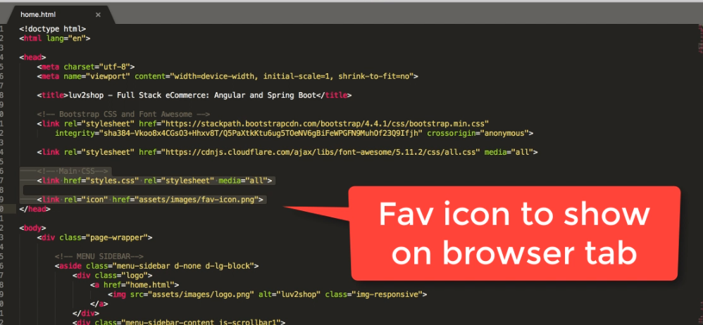
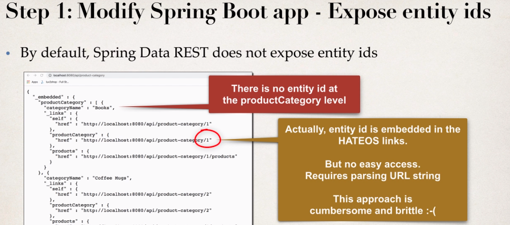
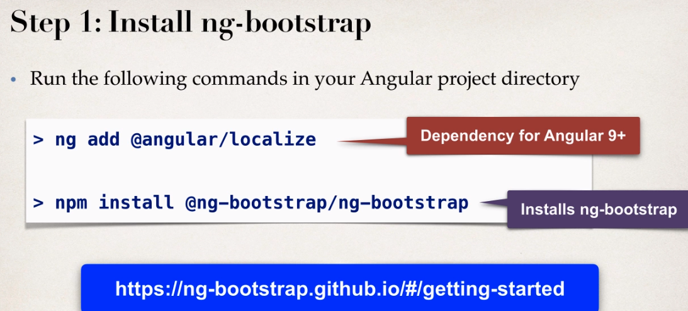
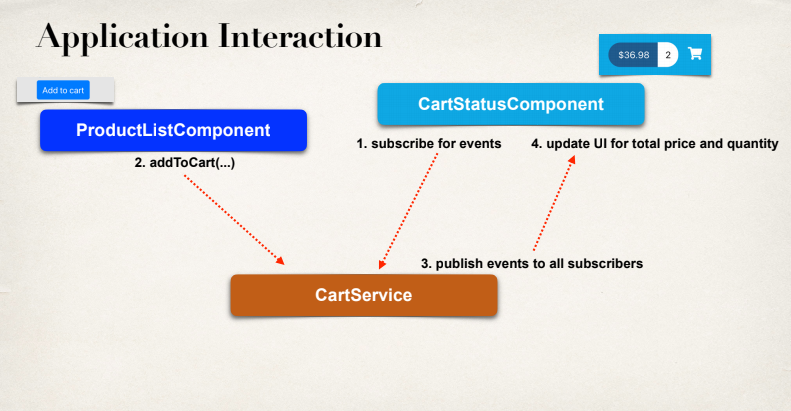

[TOC]

---

- [1. Introduction](#1-introduction)
  - [1. Introduction](#1-introduction-1)
  - [2. How To Take This Course and How To Get Help.html](#2-how-to-take-this-course-and-how-to-get-helphtml)
  - [3. Download the Source Code and PDF Files.html](#3-download-the-source-code-and-pdf-fileshtml)
- [2. Angular Overview](#2-angular-overview)
  - [1. Angular Overview](#1-angular-overview)
- [3. Set Up Development Tools](#3-set-up-development-tools)
  - [1. Set Up Development Tools](#1-set-up-development-tools)
- [4. TypeScript Crash Course - Fundamentals](#4-typescript-crash-course---fundamentals)
  - [1. TypeScript Overview](#1-typescript-overview)
  - [2. Creating our first TypeScript application](#2-creating-our-first-typescript-application)
  - [3. Defining Variables - Overview](#3-defining-variables---overview)
  - [4. Defining Variables - Write Some Code](#4-defining-variables---write-some-code)
  - [5. Creating Loops and Arrays - Overview](#5-creating-loops-and-arrays---overview)
  - [6. Creating Loops and Arrays - Write Some Code - Part 1](#6-creating-loops-and-arrays---write-some-code---part-1)
  - [7. Creating Loops and Arrays - Write Some Code - Part 2](#7-creating-loops-and-arrays---write-some-code---part-2)
- [5. TypeScript Crash Course - Creating Classes](#5-typescript-crash-course---creating-classes)
  - [1. Creating Classes - Overview](#1-creating-classes---overview)
  - [2. Creating Classes - Write Some Code](#2-creating-classes---write-some-code)
  - [3. Defining Accessors - Overview](#3-defining-accessors---overview)
  - [4. Defining Accessors - Write Some Code](#4-defining-accessors---write-some-code)
  - [5. Configuring Compiler Options with tsconfig.json](#5-configuring-compiler-options-with-tsconfigjson)
  - [6. Parameter Properties](#6-parameter-properties)
  - [7. TypeScript Modules Import and Export](#7-typescript-modules-import-and-export)
- [6. TypeScript Crash Course - Inheritance and Interfaces](#6-typescript-crash-course---inheritance-and-interfaces)
  - [1. Inheritance - Overview](#1-inheritance---overview)
  - [2. Inheritance - Creating the Superclass and Subclass](#2-inheritance---creating-the-superclass-and-subclass)
  - [3. Inheritance - Pulling it all together in a Main App](#3-inheritance---pulling-it-all-together-in-a-main-app)
  - [4. Inheritance - Developing a second Subclass](#4-inheritance---developing-a-second-subclass)
  - [5. Inheritance - Adding Shapes to an Array](#5-inheritance---adding-shapes-to-an-array)
  - [6. Abstract Classes - Overview](#6-abstract-classes---overview)
  - [7. Abstract Classes - Write Some Code](#7-abstract-classes---write-some-code)
  - [8. Interfaces - Overview](#8-interfaces---overview)
  - [9. Interfaces - Write Some Code](#9-interfaces---write-some-code)
- [7. Angular Crash Course - Fundamentals](#7-angular-crash-course---fundamentals)
  - [1. Getting Started with Angular](#1-getting-started-with-angular)
  - [2. Exploring the Angular Project](#2-exploring-the-angular-project)
  - [3. Creating a New Angular Project](#3-creating-a-new-angular-project)
  - [4. Behind The Scenes of An Angular Project - Overview](#4-behind-the-scenes-of-an-angular-project---overview)
  - [5. Behind The Scenes of An Angular Project - Demo](#5-behind-the-scenes-of-an-angular-project---demo)
  - [6. Creating a New Angular Component - Overview - Part 1](#6-creating-a-new-angular-component---overview---part-1)
  - [7. Creating a New Angular Component - Overview - Part 2](#7-creating-a-new-angular-component---overview---part-2)
  - [8. Creating a New Angular Component - Write Some Code - Part 1](#8-creating-a-new-angular-component---write-some-code---part-1)
  - [9. Creating a New Angular Component - Write Some Code - Part 2](#9-creating-a-new-angular-component---write-some-code---part-2)
  - [10. Creating a New Angular Component - Write Some Code - Part 3](#10-creating-a-new-angular-component---write-some-code---part-3)
- [8. Angular Crash Course - Bootstrap CSS, Conditionals and Formatting](#8-angular-crash-course---bootstrap-css-conditionals-and-formatting)
  - [1. Integrating Angular and Bootstrap CSS - Overview](#1-integrating-angular-and-bootstrap-css---overview)
  - [2. Integrating Angular and Bootstrap CSS - Write Some Code](#2-integrating-angular-and-bootstrap-css---write-some-code)
  - [3. Angular Conditionals and Formatting - Overview](#3-angular-conditionals-and-formatting---overview)
  - [4. Angular Conditionals and Formatting - Write Some Code](#4-angular-conditionals-and-formatting---write-some-code)
  - [5. Bonus Angular Conditionals How to highlight table row.html](#5-bonus-angular-conditionals-how-to-highlight-table-rowhtml)
- [9. eCommerce Project - Spring Boot Backend](#9-ecommerce-project---spring-boot-backend)
  - [1. Project Overview](#1-project-overview)
  - [2. Spring Boot Project Set Up](#2-spring-boot-project-set-up)
  - [3. HEADS UP Eclipse and Lombok.html](#3-heads-up-eclipse-and-lombokhtml)
  - [4. Set Up Database Tables](#4-set-up-database-tables)
  - [5. Create Spring Boot Starter Project](#5-create-spring-boot-starter-project)
  - [6. Develop JPA Entities - Part 1](#6-develop-jpa-entities---part-1)
  - [7. Develop JPA Entities - Part 2](#7-develop-jpa-entities---part-2)
  - [8. Create REST APIs with Spring Data JPA Repositories and Spring Data REST](#8-create-rest-apis-with-spring-data-jpa-repositories-and-spring-data-rest)
  - [9. REST APIs - Configure for Read Only - Overview](#9-rest-apis---configure-for-read-only---overview)
  - [10. REST APIs - Configure for Read Only - Write Some Code](#10-rest-apis---configure-for-read-only---write-some-code)
- [10. eCommerce Project - Angular Front End - Product List](#10-ecommerce-project---angular-front-end---product-list)
  - [1. Angular Project Overview - Part 1](#1-angular-project-overview---part-1)
  - [2. Angular Project Overview - Part 2](#2-angular-project-overview---part-2)
  - [3. Angular Project - Setup](#3-angular-project---setup)
  - [4. Angular Project - Create Product class and Product Service - Part 1](#4-angular-project---create-product-class-and-product-service---part-1)
  - [5. Angular Project - Create Product class and Product Service - Part 2](#5-angular-project---create-product-class-and-product-service---part-2)
  - [6. Angular Project - Update Angular Component](#6-angular-project---update-angular-component)
  - [7. Angular Project - Integrating Angular and Spring Boot for Full Stack App!](#7-angular-project---integrating-angular-and-spring-boot-for-full-stack-app)
  - [8. Angular Project - Building an HTML Table](#8-angular-project---building-an-html-table)
  - [9. Angular Project - Adding Product Images](#9-angular-project---adding-product-images)
- [11. eCommerce Project - Integrating Online Shop Template](#11-ecommerce-project---integrating-online-shop-template)
  - [1. Angular Project - Template Integration Overview](#1-angular-project---template-integration-overview)
  - [2. Angular Project - Download Starter Files](#2-angular-project---download-starter-files)
  - [2.2 Starter Files.html](#22-starter-fileshtml)
  - [3. Angular Project - Tour of HTML Template Files](#3-angular-project---tour-of-html-template-files)
  - [4. Angular Project - Install Bootstrap CSS Styles with npm](#4-angular-project---install-bootstrap-css-styles-with-npm)
  - [5. Angular Project - Add local custom CSS styles](#5-angular-project---add-local-custom-css-styles)
  - [6. Angular Project - Integrate Template Files and Logos](#6-angular-project---integrate-template-files-and-logos)
  - [7. Angular Project - Run the App](#7-angular-project---run-the-app)
  - [8. Angular Project - Add support for Product Grid](#8-angular-project---add-support-for-product-grid)
  - [9. Angular Project - Enhance Application with Product Images](#9-angular-project---enhance-application-with-product-images)
  - [10. FAQ Should I Store Images as BLOBs in Database or Files on file system.html](#10-faq-should-i-store-images-as-blobs-in-database-or-files-on-file-systemhtml)
- [12. eCommerce Project - Search for Products by Category](#12-ecommerce-project---search-for-products-by-category)
  - [1. Angular Project - Search for Products by Category - Overview - Part 1](#1-angular-project---search-for-products-by-category---overview---part-1)
  - [2. Angular Project - Search for Products by Category - Overview - Part 2](#2-angular-project---search-for-products-by-category---overview---part-2)
  - [3. Angular Project - Search for Products by Category - Overview - Part 3](#3-angular-project---search-for-products-by-category---overview---part-3)
  - [4. Angular Project - Search for Products by Category - Code - Define routes](#4-angular-project---search-for-products-by-category---code---define-routes)
  - [5. Angular Project - Search for Products by Category - Code - Define Router Outlet](#5-angular-project---search-for-products-by-category---code---define-router-outlet)
  - [6. Angular Project - Search for Products by Category - Code - Enhance ProductList](#6-angular-project---search-for-products-by-category---code---enhance-productlist)
  - [7. Angular Project - Search for Products by Category - Code - Update Spring Boot](#7-angular-project---search-for-products-by-category---code---update-spring-boot)
  - [8. Angular Project - Search for Products by Category - Code - Update ProductService](#8-angular-project---search-for-products-by-category---code---update-productservice)
- [13. eCommerce Project - Search for Products by Category (Dynamic Search Component)](#13-ecommerce-project---search-for-products-by-category-dynamic-search-component)
  - [1. Angular Project - Search for Products by Category (Dynamic Search Component 1)](#1-angular-project---search-for-products-by-category-dynamic-search-component-1)
  - [2. Angular Project - Search for Products by Category (Dynamic Search Component 2)](#2-angular-project---search-for-products-by-category-dynamic-search-component-2)
  - [3. Angular Project - Dynamic Search Component - Modify Spring Boot App](#3-angular-project---dynamic-search-component---modify-spring-boot-app)
  - [4. Angular Project - Dynamic Search Component - Create Component](#4-angular-project---dynamic-search-component---create-component)
  - [5. Angular Project - Dynamic Search Component - Call Product Service](#5-angular-project---dynamic-search-component---call-product-service)
  - [6. Angular Project - Dynamic Search Component - Add Dynamic Code to HTML](#6-angular-project---dynamic-search-component---add-dynamic-code-to-html)
  - [7. Angular Project - Dynamic Search Component - View Console Logs](#7-angular-project---dynamic-search-component---view-console-logs)
  - [8. Bonus Display Category Name in Product List Grid.html](#8-bonus-display-category-name-in-product-list-gridhtml)
- [14. eCommerce Project - Search for Products by Keyword](#14-ecommerce-project---search-for-products-by-keyword)
  - [1. Angular Project - Search for Products by Keyword - Overview - Part 1](#1-angular-project---search-for-products-by-keyword---overview---part-1)
  - [2. Angular Project - Search for Products by Keyword - Overview - Part 2](#2-angular-project---search-for-products-by-keyword---overview---part-2)
  - [3. Angular Project - Search for Products by Keyword - Overview - Part 3](#3-angular-project---search-for-products-by-keyword---overview---part-3)
  - [4. Angular Project - Search for Products by Keyword - Modify Spring Boot App](#4-angular-project---search-for-products-by-keyword---modify-spring-boot-app)
  - [5. Angular Project - Search for Products by Keyword - Angular Search Component](#5-angular-project---search-for-products-by-keyword---angular-search-component)
  - [6. Angular Project - Search for Products by Keyword - Send Data to search route](#6-angular-project---search-for-products-by-keyword---send-data-to-search-route)
  - [7. Angular Project - Search for Products by Keyword - Enhance ProductList Component](#7-angular-project---search-for-products-by-keyword---enhance-productlist-component)
  - [8. Angular Project - Search for Products by Keyword - Update ProductService API](#8-angular-project---search-for-products-by-keyword---update-productservice-api)
  - [9. Angular Project - Search for Products by Keyword - Handle for No Products Found](#9-angular-project---search-for-products-by-keyword---handle-for-no-products-found)
- [15. eCommerce Project - Product Master-Detail View](#15-ecommerce-project---product-master-detail-view)
  - [1. Angular Project - Product Master-Detail View - Overview](#1-angular-project---product-master-detail-view---overview)
  - [2. Angular Project - Product Master-Detail View - Create new component and route](#2-angular-project---product-master-detail-view---create-new-component-and-route)
  - [3. Angular Project - Product Master-Detail View - Add router links on Master page](#3-angular-project---product-master-detail-view---add-router-links-on-master-page)
  - [4. Angular Project - Product Master-Detail View - Enhance the Details Component](#4-angular-project---product-master-detail-view---enhance-the-details-component)
  - [5. Angular Project - Product Master-Detail View - Update Product Service and HTML](#5-angular-project---product-master-detail-view---update-product-service-and-html)
  - [6. Angular Project - Product Master-Detail View - Add more Product Details](#6-angular-project---product-master-detail-view---add-more-product-details)
  - [7. Angular Project - Race Conditions](#7-angular-project---race-conditions)
  - [8. IDE Extension - Angular Language Service](#8-ide-extension---angular-language-service)
- [16. eCommerce Project - Pagination](#16-ecommerce-project---pagination)
  - [1. Angular Project- Pagination Overview](#1-angular-project--pagination-overview)
  - [2. Angular Project - Pagination Development Process - Part 1](#2-angular-project---pagination-development-process---part-1)
  - [3. Angular Project - Pagination Development Process - Part 2](#3-angular-project---pagination-development-process---part-2)
  - [4. Angular Project - Pagination - Install ng-bootstrap](#4-angular-project---pagination---install-ng-bootstrap)
  - [5. Angular Project - Pagination - Add Pagination support to Product Service](#5-angular-project---pagination---add-pagination-support-to-product-service)
  - [6. Angular Project - Pagination - Update Product List Component for Pagination](#6-angular-project---pagination---update-product-list-component-for-pagination)
  - [7. Angular Project - Pagination - Enhance HTML template to use Pagination Component](#7-angular-project---pagination---enhance-html-template-to-use-pagination-component)
  - [8. Angular Project - Pagination Demo](#8-angular-project---pagination-demo)
  - [9. Angular Project - Pagination - Selecting Page Size - Part 1](#9-angular-project---pagination---selecting-page-size---part-1)
  - [10. Angular Project - Pagination - Selecting Page Size - Part 2](#10-angular-project---pagination---selecting-page-size---part-2)
  - [11. Angular Project - Pagination - Setting Max Size and Adding Boundary Links](#11-angular-project---pagination---setting-max-size-and-adding-boundary-links)
  - [12. Angular Project - Pagination - Keyword Search Overview](#12-angular-project---pagination---keyword-search-overview)
  - [13. Angular Project - Pagingation - Keyword Search - Update ProductService](#13-angular-project---pagingation---keyword-search---update-productservice)
  - [14. Angular Project - Pagingation - Keyword Search - Update ProductListComponent](#14-angular-project---pagingation---keyword-search---update-productlistcomponent)
- [17. eCommerce Project - Shopping Cart Status Component](#17-ecommerce-project---shopping-cart-status-component)
  - [1. Angular Project - Shopping Cart Status Overview - Basics](#1-angular-project---shopping-cart-status-overview---basics)
  - [2. Angular Project - Shopping Cart Status - Create new component](#2-angular-project---shopping-cart-status---create-new-component)
  - [3. Angular Project - Shopping Cart Status - Add Click Handler](#3-angular-project---shopping-cart-status---add-click-handler)
  - [4. Angular Project - Shopping Cart Status Overview - Advanced](#4-angular-project---shopping-cart-status-overview---advanced)
  - [5. Angular Project - Shopping Cart Status Overview - Advanced - Cart Service](#5-angular-project---shopping-cart-status-overview---advanced---cart-service)
  - [6. Angular Project - Shopping Cart Status Overview - Create model class CartItem](#6-angular-project---shopping-cart-status-overview---create-model-class-cartitem)
  - [7. Angular Project - Shopping Cart Status - Develop CartService - Add to Cart](#7-angular-project---shopping-cart-status---develop-cartservice---add-to-cart)
  - [8. Angular Project - Shopping Cart Status - Develop CartService - Compute Totals](#8-angular-project---shopping-cart-status---develop-cartservice---compute-totals)
  - [9. Angular Project - Shopping Cart Status - Call CartService](#9-angular-project---shopping-cart-status---call-cartservice)
  - [10. Angular Project - Shopping Cart Status - Subscribe to CartService Display Totals](#10-angular-project---shopping-cart-status---subscribe-to-cartservice-display-totals)
  - [11. Angular Project - Shopping Cart Status - Refactor Cart Service Overview](#11-angular-project---shopping-cart-status---refactor-cart-service-overview)
  - [12. Angular Project - Shopping Cart Status - Refactor Cart Service - Write the Code](#12-angular-project---shopping-cart-status---refactor-cart-service---write-the-code)
  - [13. Angular Project - Shopping Cart Status - Add To Cart From Details View](#13-angular-project---shopping-cart-status---add-to-cart-from-details-view)
  - [14. Angular Project - Shopping Cart Status - Add To Cart From Details View - Coding](#14-angular-project---shopping-cart-status---add-to-cart-from-details-view---coding)
- [18. eCommerce Project - List Shopping Cart Items](#18-ecommerce-project---list-shopping-cart-items)
  - [1. Angular Project - List Shopping Cart Items - Overview](#1-angular-project---list-shopping-cart-items---overview)
  - [2. Angular Project - List Shopping Cart Items - Create CartDetailsComponent](#2-angular-project---list-shopping-cart-items---create-cartdetailscomponent)
  - [3. Angular Project - List Shopping Cart Items - Create HTML Table](#3-angular-project---list-shopping-cart-items---create-html-table)
  - [4. Angular Project - List Shopping Cart Items - Retrieve data from Cart Service](#4-angular-project---list-shopping-cart-items---retrieve-data-from-cart-service)
  - [5. Angular Project - List Shopping Cart Items - Loop over Cart Items in HTML](#5-angular-project---list-shopping-cart-items---loop-over-cart-items-in-html)
  - [6. Angular Project - List Shopping Cart Items - Display Cart Totals](#6-angular-project---list-shopping-cart-items---display-cart-totals)
- [19. More Content is Coming](#19-more-content-is-coming)
  - [1. More Content is Coming.html](#1-more-content-is-cominghtml)
- [20. Summary](#20-summary)
  - [1. Thank You](#1-thank-you)

C:\Users\Admin\AppData\Local\Programs\Python\Python38-32\python.exe E:/programing/language/python/python-docs/readfile.py
======== name dir ========

## 1. Introduction

### 1. Introduction

### 2. How To Take This Course and How To Get Help.html

How To Take This Course and How To Get Help

**How To Take This Course**

As you go through the course, I highly recommend that you type the code along with me in the videos. This is the best way to learn the material.

Some students will watch the video first and then replay it while typing in the code. Others like to type along on the first watch. Choose whatever approach works for you.

But the important thing is that you type in the code. This is the most effective way to really learn the material.

\----

**\*How To Get Help\***

If you have any coding questions or have a syntax error, here's how you can get help:

**1. Download the source code.**

Every coding video has the solution code attached. You can download the solution and compare your code against the solution code.

**2. Post a Message**

If you are not able to resolve the problem, post a message to the discussion forum. Be sure to paste your Java source code along with any relevant config files.

I'm a very responsive instructor and I'll respond to your question in 24 hours.

Enjoy the class :-)

### 3. Download the Source Code and PDF Files.html

Download the Source Code and PDF Files

**Download Source Code:**

You have two options for downloading the code.

_Option 1: Download zip file_

File: [**full-stack-angular-and-springboot-master.zip**](https://github.com/darbyluv2code/fullstack-angular-and-springboot/archive/master.zip)

_
Option 2: Download using git command-line_

You also have the option to download source code using git command-line.

```
git clone https://github.com/darbyluv2code/fullstack-angular-and-springboot.git
```

Note: Option 1 and Option 2 both reference the exact same code. You only need to choose one of the options.

\---
**Download PDF Files**

All slides which are shown during the course are available also as a reference and can be downloaded here:

http://www.luv2code.com/download-full-stack-angular-and-springboot-pdf-slides

## 2. Angular Overview

### 1. Angular Overview

## 3. Set Up Development Tools

### 1. Set Up Development Tools

## 4. TypeScript Crash Course - Fundamentals

### 1. TypeScript Overview

`tsc hello.ts`

### 2. Creating our first TypeScript application


### 3. Defining Variables - Overview

### 4. Defining Variables - Write Some Code

### 5. Creating Loops and Arrays - Overview

```ts
let reviews: number[] = [5, 5, 4.5, 1, 3];

let total: number = 0;

for (let i = 0; i < reviews.length; i++) {
  console.log(reviews[i]);
  total += reviews[i];
}

let average: number = total / reviews.length;
console.log('Review average = ' + average);

let sportsTwo: string[] = ['Golf', 'Cricket', 'Tennis'];

sportsTwo.push('Baseball');
sportsTwo.push('Futbol');

for (let tempSport of sportsTwo) {
  console.log(tempSport);
}

let sportsOne: string[] = ['Golf', 'Cricket', 'Tennis', 'Swimming'];

for (let tempSport of sportsOne) {
  if (tempSport == 'Cricket') {
    console.log(tempSport + ' << My Favorite!');
  } else {
    console.log(tempSport);
  }
}
```

### 6. Creating Loops and Arrays - Write Some Code - Part 1

### 7. Creating Loops and Arrays - Write Some Code - Part 2

## 5. TypeScript Crash Course - Creating Classes

### 1. Creating Classes - Overview

```ts
class Customer {
  firstName: string;
  lastName: string;

  constructor(theFirst: string, theLast: string) {
    this.firstName = theFirst;
    this.lastName = theLast;
  }
}

// let's create an instance
let myCustomer = new Customer('Martin', 'Dixon');

console.log(myCustomer.firstName);
console.log(myCustomer.lastName);
```


### 2. Creating Classes - Write Some Code

### 3. Defining Accessors - Overview

```ts
class Customer {
  private _firstName: string;
  private _lastName: string;

  constructor(theFirst: string, theLast: string) {
    this._firstName = theFirst;
    this._lastName = theLast;
  }

  public get firstName(): string {
    return this._firstName;
  }

  public set firstName(value: string) {
    this._firstName = value;
  }

  public get lastName(): string {
    return this._lastName;
  }
  public set lastName(value: string) {
    this._lastName = value;
  }
}

// let's create an instance
let myCustomer = new Customer('Martin', 'Dixon');

myCustomer.firstName = 'Susan';
myCustomer.lastName = 'Public';

console.log(myCustomer.firstName);
console.log(myCustomer.lastName);
```


### 4. Defining Accessors - Write Some Code

### 5. Configuring Compiler Options with tsconfig.json

`tsc --init`

### 6. Parameter Properties


```ts
class Customer {
  constructor(private _firstName: string, private _lastName: string) {}

  public get firstName(): string {
    return this._firstName;
  }

  public set firstName(value: string) {
    this._firstName = value;
  }

  public get lastName(): string {
    return this._lastName;
  }
  public set lastName(value: string) {
    this._lastName = value;
  }
}

// let's create an instance
let myCustomer = new Customer('Martin', 'Dixon');

console.log(myCustomer.firstName);
console.log(myCustomer.lastName);
```

```shell
tsc --init
tsc --build --clean
tsc
```

### 7. TypeScript Modules Import and Export

export class ...

import {Customer} from ..

## 6. TypeScript Crash Course - Inheritance and Interfaces

### 1. Inheritance - Overview


### 2. Inheritance - Creating the Superclass and Subclass

Shape.ts

```ts
export class Shape {
  constructor(private _x: number, private _y: number) {}

  public get x(): number {
    return this._x;
  }

  public set x(value: number) {
    this._x = value;
  }

  public get y(): number {
    return this._y;
  }

  public set y(value: number) {
    this._y = value;
  }

  getInfo(): string {
    return `x=${this._x}, y=${this._y}`;
  }
}
```

Rectangle.ts

```ts
import { Shape } from './Shape';

export class Rectangle extends Shape {
  constructor(
    theX: number,
    theY: number,
    private _width: number,
    private _length: number
  ) {
    super(theX, theY);
  }

  public get width(): number {
    return this._width;
  }

  public set width(value: number) {
    this._width = value;
  }

  public get length(): number {
    return this._length;
  }

  public set length(value: number) {
    this._length = value;
  }

  getInfo(): string {
    return super.getInfo() + `, width=${this._width}, length=${this._length}`;
  }
}
```

Driver.ts

```ts
import { Shape } from './Shape';
import { Circle } from './Circle';
import { Rectangle } from './Rectangle';

let myShape = new Shape(10, 15);
console.log(myShape.getInfo());

let myCircle = new Circle(5, 10, 20);
console.log(myCircle.getInfo());

let myRectangle = new Rectangle(0, 0, 3, 7);
console.log(myRectangle.getInfo());
```

Array.ts

```ts
import { Shape } from './Shape';
import { Circle } from './Circle';
import { Rectangle } from './Rectangle';

let myShape = new Shape(10, 15);
let myCircle = new Circle(5, 10, 20);
let myRectangle = new Rectangle(0, 0, 3, 7);

// declare an array of shapes ... initially empty
let theShapes: Shape[] = [];

// add the shapes to the array
theShapes.push(myShape);
theShapes.push(myCircle);
theShapes.push(myRectangle);

for (let tempShape of theShapes) {
  console.log(tempShape.getInfo());
}
```

### 3. Inheritance - Pulling it all together in a Main App

### 4. Inheritance - Developing a second Subclass

### 5. Inheritance - Adding Shapes to an Array

### 6. Abstract Classes - Overview

Shape.ts

```ts
export abstract class Shape {
  constructor(private _x: number, private _y: number) {}

  public get x(): number {
    return this._x;
  }

  public set x(value: number) {
    this._x = value;
  }

  public get y(): number {
    return this._y;
  }

  public set y(value: number) {
    this._y = value;
  }

  getInfo(): string {
    return `x=${this._x}, y=${this._y}`;
  }

  abstract calculateArea(): number;
}
```

Circle.ts

```ts
import { Shape } from './Shape';

export class Circle extends Shape {
  calculateArea(): number {
    return Math.PI * Math.pow(this._radius, 2);
  }

  constructor(theX: number, theY: number, private _radius: number) {
    super(theX, theY);
  }

  public get radius(): number {
    return this._radius;
  }

  public set radius(value: number) {
    this._radius = value;
  }

  getInfo(): string {
    return super.getInfo() + `, radius=${this._radius}`;
  }
}
```

ArraysDriver.ts

```ts
import { Shape } from './Shape';
import { Circle } from './Circle';
import { Rectangle } from './Rectangle';

let myCircle = new Circle(5, 10, 20);
let myRectangle = new Rectangle(0, 0, 3, 7);

// declare an array of shapes ... initially empty
let theShapes: Shape[] = [];

// add the shapes to the array
theShapes.push(myCircle);
theShapes.push(myRectangle);

for (let tempShape of theShapes) {
  console.log(tempShape.getInfo());
  console.log(tempShape.calculateArea());
  console.log();
}
```

### 7. Abstract Classes - Write Some Code

### 8. Interfaces - Overview

Coach

```ts
export interface Coach {
  getDailyWorkout(): string;
}
```

CrikeyCoach.ts

```ts
import { Coach } from './Coach';

export class CricketCoach implements Coach {
  getDailyWorkout(): string {
    return 'Practice your spin bowling technique.';
  }
}
```

Drriver

```ts
import { CricketCoach } from './CricketCoach';
import { GolfCoach } from './GolfCoach';
import { Coach } from './Coach';

let myCricketCoach = new CricketCoach();
let myGolfCoach = new GolfCoach();

// declare an array for coaches ... initially empty
let theCoaches: Coach[] = [];

// add the coaches to the array
theCoaches.push(myCricketCoach);
theCoaches.push(myGolfCoach);

for (let tempCoach of theCoaches) {
  console.log(tempCoach.getDailyWorkout());
}
```

### 9. Interfaces - Write Some Code

## 7. Angular Crash Course - Fundamentals

### 1. Getting Started with Angular

### 2. Exploring the Angular Project

### 3. Creating a New Angular Project

### 4. Behind The Scenes of An Angular Project - Overview


### 5. Behind The Scenes of An Angular Project - Demo

### 6. Creating a New Angular Component - Overview - Part 1

### 7. Creating a New Angular Component - Overview - Part 2

`ng generate class sales-person-list/SalesPerson`

### 8. Creating a New Angular Component - Write Some Code - Part 1

### 9. Creating a New Angular Component - Write Some Code - Part 2

### 10. Creating a New Angular Component - Write Some Code - Part 3

## 8. Angular Crash Course - Bootstrap CSS, Conditionals and Formatting

### 1. Integrating Angular and Bootstrap CSS - Overview

### 2. Integrating Angular and Bootstrap CSS - Write Some Code

### 3. Angular Conditionals and Formatting - Overview

sales-person-list-bootstrap.component.html

```html
<table class="table table-hover">

    <thead class="thead-dark">
        <tr>
            <th>First Name</th>
            <th>Last Name</th>
            <th>Email</th>
            <th>Sales Volume</th>
            <th>Met Quota?</th>
        </tr>
    </thead>

    <tbody>
        <tr *ngFor="let tempSalesPerson of salesPersonList">
            <td>{{ tempSalesPerson.firstName }}</td>
            <td>{{ tempSalesPerson.lastName }}</td>
            <td>{{ tempSalesPerson.email }}</td>
            <td>{{ tempSalesPerson.salesVolume | currency:'USD'}}</td>

            <td>
                <div *ngIf="tempSalesPerson.salesVolume >= 60000; else myElseBlock">Yes</div>
                <ng-template #myElseBlock>No</ng-template>
            </td>
        </tr>

    </tbody>

</table>
```


### 4. Angular Conditionals and Formatting - Write Some Code

### 5. Bonus Angular Conditionals How to highlight table row.html

Bonus: Angular Conditionals: How to highlight table row

**Question**

We have learned we can display condition value for Met Quota column by ngIf. If I wanted to highlighted complete row as background color green which has sales volume 60000 or more. How can I accomplish this task?


**Answer**

[***Read the complete answer online\***](https://github.com/darbyluv2code/fullstack-angular-and-springboot/blob/master/bonus-content/angular-crash-course/02-ngIf-highlight-entire-row/02-ngif-highligh-entire-row.md)

https://github.com/darbyluv2code/fullstack-angular-and-springboot/blob/master/bonus-content/angular-crash-course/02-ngIf-highlight-entire-row/02-ngif-highligh-entire-row.md


## Development Process

1. Create a local CSS style for Green
2. Update HTML to apply style to row

------

### 1. Create a local CSS style for Green

In the CSS file for your component, you can create a local CSS style. This is setting the background color of an element to green.

File: **sales-person-list.component.css**

```
    .highlight {
      background-color:green
    }
```

### 2. Update HTML to apply style to row

In your component, you can make use of `[ngClass]` to conditionally apply styles to an element.

The basic syntax is:

```
    <div [ngClass]="{
       'class1': condition  (the true condition),
       'class2': !condition (else)
    }">
```

In our example, we will use the `[ngClass]`. This will give a red background for the entire row for a sales person whose `quota is >= 60000`.

## 9. eCommerce Project - Spring Boot Backend

### 1. Project Overview

### 2. Spring Boot Project Set Up

### 3. HEADS UP Eclipse and Lombok.html

HEADS UP: Eclipse and Lombok

**Eclipse and Lombok**

If you are using Eclipse instead of IntelliJ, there are additional installations steps you need.

To add Lombok support to Eclipse. Follow the steps below:


\1. Download the Lombok JAR file installer from this link:

https://projectlombok.org/downloads/lombok.jar


\2. Double-click the downloaded JAR file installer to start the installation process.


Note: Instead of double-click, you can run the installer from the command line. Move to the directory where you downloaded the file.

```
java -jar lombok.jar
```


\3. Follow the steps in the installer.

### 4. Set Up Database Tables

  

create-user

```sql
CREATE USER 'ecommerceapp'@'localhost' IDENTIFIED BY 'ecommerceapp';

GRANT ALL PRIVILEGES ON * . * TO 'ecommerceapp'@'localhost';

#
# Starting with MySQL 8.0.4, the MySQL team changed the 
# default authentication plugin for MySQL server 
# from mysql_native_password to caching_sha2_password.
#
# The command below will make the appropriate updates for your user account.
#
# See the MySQL Reference Manual for details: 
# https://dev.mysql.com/doc/refman/8.0/en/caching-sha2-pluggable-authentication.html
#
ALTER USER 'ecommerceapp'@'localhost' IDENTIFIED WITH mysql_native_password BY 'ecommerceapp';
```

create-product

```sql
-- -----------------------------------------------------
-- Schema full-stack-ecommerce
-- -----------------------------------------------------
DROP SCHEMA IF EXISTS `full-stack-ecommerce`;

CREATE SCHEMA `full-stack-ecommerce`;
USE `full-stack-ecommerce` ;

-- -----------------------------------------------------
-- Table `full-stack-ecommerce`.`product_category`
-- -----------------------------------------------------
CREATE TABLE IF NOT EXISTS `full-stack-ecommerce`.`product_category` (
  `id` BIGINT(20) NOT NULL AUTO_INCREMENT,
  `category_name` VARCHAR(255) NULL DEFAULT NULL,
  PRIMARY KEY (`id`))
ENGINE=InnoDB
AUTO_INCREMENT = 1;

-- -----------------------------------------------------
-- Table `full-stack-ecommerce`.`product`
-- -----------------------------------------------------
CREATE TABLE IF NOT EXISTS `full-stack-ecommerce`.`product` (
  `id` BIGINT(20) NOT NULL AUTO_INCREMENT,
  `sku` VARCHAR(255) DEFAULT NULL,
  `name` VARCHAR(255) DEFAULT NULL,
  `description` VARCHAR(255) DEFAULT NULL,
  `unit_price` DECIMAL(13,2) DEFAULT NULL,
  `image_url` VARCHAR(255) DEFAULT NULL,
  `active` BIT DEFAULT 1,
  `units_in_stock` INT(11) DEFAULT NULL,
   `date_created` DATETIME(6) DEFAULT NULL,
  `last_updated` DATETIME(6) DEFAULT NULL,
  `category_id` BIGINT(20) NOT NULL,
  PRIMARY KEY (`id`),
  KEY `fk_category` (`category_id`),
  CONSTRAINT `fk_category` FOREIGN KEY (`category_id`) REFERENCES `product_category` (`id`)
) 
ENGINE=InnoDB
AUTO_INCREMENT = 1;


-- -----------------------------------------------------
-- Add sample data
-- -----------------------------------------------------

INSERT INTO PRODUCT_CATEGORY(CATEGORY_NAME) VALUES ('BOOKS');

INSERT INTO PRODUCT (SKU, NAME, DESCRIPTION, IMAGE_URL, ACTIVE, UNITS_IN_STOCK,
UNIT_PRICE, CATEGORY_ID,DATE_CREATED)
VALUES ('BOOK-TECH-1000', 'JavaScript - The Fun Parts', 'Learn JavaScript',
'assets/images/products/placeholder.png'
,1,100,19.99,1, NOW());

INSERT INTO PRODUCT (SKU, NAME, DESCRIPTION, IMAGE_URL, ACTIVE, UNITS_IN_STOCK,
UNIT_PRICE, CATEGORY_ID, DATE_CREATED)
VALUES ('BOOK-TECH-1001', 'Spring Framework Tutorial', 'Learn Spring',
'assets/images/products/placeholder.png'
,1,100,29.99,1, NOW());

INSERT INTO PRODUCT (SKU, NAME, DESCRIPTION, IMAGE_URL, ACTIVE, UNITS_IN_STOCK,
UNIT_PRICE, CATEGORY_ID, DATE_CREATED)
VALUES ('BOOK-TECH-1002', 'Kubernetes - Deploying Containers', 'Learn Kubernetes',
'assets/images/products/placeholder.png'
,1,100,24.99,1, NOW());

INSERT INTO PRODUCT (SKU, NAME, DESCRIPTION, IMAGE_URL, ACTIVE, UNITS_IN_STOCK,
UNIT_PRICE, CATEGORY_ID, DATE_CREATED)
VALUES ('BOOK-TECH-1003', 'Internet of Things (IoT) - Getting Started', 'Learn IoT',
'assets/images/products/placeholder.png'
,1,100,29.99,1, NOW());

INSERT INTO PRODUCT (SKU, NAME, DESCRIPTION, IMAGE_URL, ACTIVE, UNITS_IN_STOCK,
UNIT_PRICE, CATEGORY_ID, DATE_CREATED)
VALUES ('BOOK-TECH-1004', 'The Go Programming Language: A to Z', 'Learn Go',
'assets/images/products/placeholder.png'
,1,100,24.99,1, NOW());

```


### 5. Create Spring Boot Starter Project

  

  


### 6. Develop JPA Entities - Part 1

  


### 7. Develop JPA Entities - Part 2

application.properties

```properties
spring.datasource.driver-class-name=com.mysql.cj.jdbc.Driver
spring.datasource.url=jdbc:mysql://localhost:3306/full-stack-ecommerce?useSSL=false&useUnicode=yes&characterEncoding=UTF-8&allowPublicKeyRetrieval=true&serverTimezone=UTC
spring.datasource.username=ecommerceapp
spring.datasource.password=ecommerceapp

spring.jpa.properties.hibernate.dialect=org.hibernate.dialect.MySQL8Dialect

spring.data.rest.base-path=/api


```

  

entity/Product.java

```java
package com.luv2code.ecommerce.entity;

import lombok.Data;
import org.hibernate.annotations.CreationTimestamp;
import org.hibernate.annotations.UpdateTimestamp;

import javax.persistence.*;
import java.math.BigDecimal;
import java.util.Date;

@Entity
@Table(name="product")
@Data
public class Product {

    @Id
    @GeneratedValue(strategy = GenerationType.IDENTITY)
    @Column(name = "id")
    private Long id;

    @ManyToOne
    @JoinColumn(name = "category_id", nullable = false)
    private ProductCategory category;

    @Column(name = "sku")
    private String sku;

    @Column(name = "name")
    private String name;

    @Column(name = "description")
    private String description;

    @Column(name = "unit_price")
    private BigDecimal unitPrice;

    @Column(name = "image_url")
    private String imageUrl;

    @Column(name = "active")
    private boolean active;

    @Column(name = "units_in_stock")
    private int unitsInStock;

    @Column(name = "date_created")
    @CreationTimestamp
    private Date dateCreated;

    @Column(name = "last_updated")
    @UpdateTimestamp
    private Date lastUpdated;
}

```

ProductCategory

```java
package com.luv2code.ecommerce.entity;

import lombok.Getter;
import lombok.Setter;

import javax.persistence.*;
import java.util.Set;

@Entity
@Table(name="product_category")
// @Data -- known bug
@Getter
@Setter
public class ProductCategory {

    @Id
    @GeneratedValue(strategy = GenerationType.IDENTITY)
    @Column(name = "id")
    private Long id;

    @Column(name = "category_name")
    private String categoryName;

    @OneToMany(cascade = CascadeType.ALL, mappedBy = "category")
    private Set<Product> products;

}
```


### 8. Create REST APIs with Spring Data JPA Repositories and Spring Data REST

ProductRepository.java

```java
package com.luv2code.ecommerce.dao;

import com.luv2code.ecommerce.entity.Product;
import org.springframework.data.jpa.repository.JpaRepository;
import org.springframework.web.bind.annotation.CrossOrigin;

@CrossOrigin("http://localhost:4200")
public interface ProductRepository extends JpaRepository<Product, Long> {
}

```

ProductCategoryRepository.java

```java
package com.luv2code.ecommerce.dao;

import com.luv2code.ecommerce.entity.ProductCategory;
import org.springframework.data.jpa.repository.JpaRepository;
import org.springframework.data.rest.core.annotation.RepositoryRestResource;
import org.springframework.web.bind.annotation.CrossOrigin;

@CrossOrigin("http://localhost:4200")
@RepositoryRestResource(collectionResourceRel = "productCategory", path = "product-category")
public interface ProductCategoryRepository extends JpaRepository<ProductCategory, Long> {
}

```

  

  

  


### 9. REST APIs - Configure for Read Only - Overview

### 10. REST APIs - Configure for Read Only - Write Some Code

config/MyDataRestConfig.java

```java
package com.luv2code.ecommerce.config;

import com.luv2code.ecommerce.entity.Product;
import com.luv2code.ecommerce.entity.ProductCategory;
import org.springframework.context.annotation.Configuration;
import org.springframework.data.rest.core.config.RepositoryRestConfiguration;
import org.springframework.data.rest.webmvc.config.RepositoryRestConfigurer;
import org.springframework.http.HttpMethod;

@Configuration
public class MyDataRestConfig implements RepositoryRestConfigurer {

    @Override
    public void configureRepositoryRestConfiguration(RepositoryRestConfiguration config) {

        HttpMethod[] theUnsupportedActions = {HttpMethod.PUT, HttpMethod.POST, HttpMethod.DELETE, HttpMethod.PATCH};

        // disable HTTP methods for Product: PUT, POST, DELETE and PATCH
        config.getExposureConfiguration()
                .forDomainType(Product.class)
                .withItemExposure((metdata, httpMethods) -> httpMethods.disable(theUnsupportedActions))
                .withCollectionExposure((metdata, httpMethods) -> httpMethods.disable(theUnsupportedActions));

        // disable HTTP methods for ProductCategory: PUT, POST, DELETE and PATCH
        config.getExposureConfiguration()
                .forDomainType(ProductCategory.class)
                .withItemExposure((metdata, httpMethods) -> httpMethods.disable(theUnsupportedActions))
                .withCollectionExposure((metdata, httpMethods) -> httpMethods.disable(theUnsupportedActions));

    }
}
```

  

## 10. eCommerce Project - Angular Front End - Product List

### 1. Angular Project Overview - Part 1

### 2. Angular Project Overview - Part 2

  

### 3. Angular Project - Setup

`ng new project`

index.html

```html
<!doctype html>
<html lang="en">
<head>
  <meta charset="utf-8">

    <!-- add  start -->
  <meta name="viewport" content="width=device-width, initial-scale=1, shrink-to-fit=no">

  <!-- Bootstrap CSS -->
  <link rel="stylesheet" href="https://stackpath.bootstrapcdn.com/bootstrap/4.4.0/css/bootstrap.min.css" integrity="sha384-SI27wrMjH3ZZ89r4o+fGIJtnzkAnFs3E4qz9DIYioCQ5l9Rd/7UAa8DHcaL8jkWt" crossorigin="anonymous">
    <!-- add  end -->

  <title>AngularEcommerce</title>
  <base href="/">
  <link rel="icon" type="image/x-icon" href="favicon.ico">
</head>
<body>
  <app-root></app-root>
</body>
</html>

```

command

```shell
ng g c components/product-list
ng generate class common/product
ng generate service services/product
```

product-list.component.html

```html
<p *ngFor="let tempProduct of products">
    {{ tempProduct.name}}: {{ tempProduct.unitPrice | currency:'USD'}}
</p>
```

product-list.component.ts

```ts
import { Component, OnInit } from '@angular/core';
import { ProductService } from 'src/app/services/product.service';
import { Product } from 'src/app/common/product';

@Component({
  selector: 'app-product-list',
  templateUrl: './product-list.component.html',
  styleUrls: ['./product-list.component.css']
})
export class ProductListComponent implements OnInit {

  products: Product[];
  
  constructor(private productService: ProductService) { }

  ngOnInit() {
    this.listProducts();
  }

  listProducts() {
    this.productService.getProductList().subscribe(
      data => {
        this.products = data;
      }
    )
  }

}

```


### 4. Angular Project - Create Product class and Product Service - Part 1

product

```ts
export class Product {
    sku: string;
    name: string;
    description: string;
    unitPrice: number;
    imageUrl: string;
    active: boolean;
    unitsInStock: number;
    dateCreated: Date;
    lastUpdate: Date;
}

```

product.service.ts

```ts
import { Injectable } from '@angular/core';
import { HttpClient } from '@angular/common/http';
import { Product } from '../common/product';
import { Observable } from 'rxjs';
import { map } from 'rxjs/operators';

@Injectable({
  providedIn: 'root'
})
export class ProductService {

  private baseUrl = 'http://localhost:8080/api/products';

  constructor(private httpClient: HttpClient) { }

  getProductList(): Observable<Product[]> {
    return this.httpClient.get<GetResponse>(this.baseUrl).pipe(
      map(response => response._embedded.products)
    );
  }
}

interface GetResponse {
  _embedded: {
    products: Product[];
  }
}
```

app.module.ts

```ts
import { BrowserModule } from '@angular/platform-browser';
import { NgModule } from '@angular/core';

import { AppComponent } from './app.component';
import { ProductListComponent } from './components/product-list/product-list.component';
import { HttpClientModule } from '@angular/common/http';
import { ProductService } from './services/product.service';

@NgModule({
  declarations: [
    AppComponent,
    ProductListComponent
  ],
  imports: [
    BrowserModule,
    HttpClientModule // add
  ],
  providers: [ProductService], // add
  bootstrap: [AppComponent]
})
export class AppModule { }

```


### 5. Angular Project - Create Product class and Product Service - Part 2

### 6. Angular Project - Update Angular Component


### 7. Angular Project - Integrating Angular and Spring Boot for Full Stack App!

### 8. Angular Project - Building an HTML Table

  

product-list-table.component.html

```html
<table class="table">

    <thead class="thead-dark">
        <tr>
            <th></th>
            <th>Name</th>
            <th>Price</th>
            <th>Units in Stock</th>
        </tr>
    </thead>

    <tbody>
        <tr *ngFor="let tempProduct of products">
            <td class="align-middle">
                
            </td>
            <td class="align-middle">{{ tempProduct.name}}</td>
            <td class="align-middle">{{ tempProduct.unitPrice | currency:'USD'}}</td>
            <td class="align-middle">{{ tempProduct.unitsInStock}}</td>
        </tr>

    </tbody>
</table>
```


### 9. Angular Project - Adding Product Images

  

  

copy images to assets folder

## 11. eCommerce Project - Integrating Online Shop Template

### 1. Angular Project - Template Integration Overview

### 2. Angular Project - Download Starter Files

  


### 2.2 Starter Files.html

http://www.luv2code.com/ecommerce-release-2.0-starter-files

### 3. Angular Project - Tour of HTML Template Files

  



### 4. Angular Project - Install Bootstrap CSS Styles with npm

  

```shell
npm install --save bootstrap
npm audit fix
npm install --save @fortawesome/fontawesome-free

```

angular.json

```json
{
  "$schema": "./node_modules/@angular/cli/lib/config/schema.json",
  "version": 1,
  "newProjectRoot": "projects",
  "projects": {
    "angular-ecommerce": {
      "projectType": "application",
      "schematics": {},
      "root": "",
      "sourceRoot": "src",
      "prefix": "app",
      "architect": {
        "build": {
          "builder": "@angular-devkit/build-angular:browser",
          "options": {
            "outputPath": "dist/angular-ecommerce",
            "index": "src/index.html",
            "main": "src/main.ts",
            "polyfills": "src/polyfills.ts",
            "tsConfig": "tsconfig.app.json",
            "aot": false,
            "assets": [
              "src/favicon.ico",
              "src/assets"
            ],
            // add --------------------
            "styles": [
              "src/styles.css",
              "node_modules/bootstrap/dist/css/bootstrap.min.css",
              "node_modules/@fortawesome/fontawesome-free/css/all.min.css"
            ],
            "scripts": []
          },
```

  

copy style.csss

### 5. Angular Project - Add local custom CSS styles

index.html

```html
<!doctype html>
<html lang="en">
<head>
  <meta charset="utf-8">

  <meta name="viewport" content="width=device-width, initial-scale=1, shrink-to-fit=no">

  <title>luv2shop - Full Stack eCommerce: Angular and Spring Boot</title>
  <base href="/">
  <link rel="icon" type="image/x-icon" href="favicon.ico?v=2">
</head>
<body>
  <app-root></app-root>
</body>
</html>

```


### 6. Angular Project - Integrate Template Files and Logos

copy vo assets v html

app.component.html

```html
<div class="page-wrapper">

  <!-- MENU SIDEBAR-->
  <aside class="menu-sidebar d-none d-lg-block">
    <div class="logo">
      <a href="#">
        
      </a>
    </div>
    <div class="menu-sidebar-content js-scrollbar1">
      <nav class="navbar-sidebar">
        <ul class="list-unstyled navbar-list">
          <li>
            <a href="#">Books</a>
          </li>
          <li>
            <a href="#">Coffee Mugs</a>
          </li>
          <li>
            <a href="#">Mouse Pads</a>
          </li>
          <li>
            <a href="#">Luggage Tags</a>
          </li>
        </ul>
      </nav>
    </div>
  </aside>
  <!-- END MENU SIDEBAR-->

  <div class="page-container">
    <!-- HEADER DESKTOP-->
    <header class="header-desktop">
      <div class="section-content section-content-p30">
        <div class="container-fluid">
          <div class="header-wrap">
            <form class="form-header" onsubmit="return false;" method="GET">
              <input class="au-input au-input-xl" type="text" name="search" placeholder="Search for data ..." />
              <button class="au-btn-submit" type="submit">
                Search
              </button>
            </form>
            <div class="cart-area d-n">
              <a href="shopping-detail.html">
                <div class="total">19.22 <span> 2</span> </div> <i class="fa fa-shopping-cart" aria-hidden="true"></i>
              </a>
            </div>
          </div>
          <div class="account-wrap"></div>
        </div>
      </div>
    </header>
    <!-- END HEADER DESKTOP-->

    <!-- MAIN CONTENT-->
    <app-product-list></app-product-list>

  </div>
</div>

<!-- ENDS PAGE CONTAINER -->

<footer>
  <ul>
    <li><a href="#">About Us</a></li>
    <li><a href="#">Contact Us</a></li>
    <li><a href="#">Help</a></li>
  </ul>
</footer>
```

product-list-grid.component.html

```html
<div class="main-content">
    <div class="section-content section-content-p30">
        <div class="container-fluid">
            <div class="row">

                <!-- loop over the collection of products -->
                <div *ngFor="let tempProduct of products" class="col-md-3">

                    <div class="product-box">
                        
                        <h1>{{ tempProduct.name }}</h1>
                        <div class="price">{{ tempProduct.unitPrice | currency:'USD' }}</div>
                        <a href="#" class="primary-btn">Add to cart</a>
                    </div>

                </div>
            </div>
        </div>
    </div>
</div>
```


### 7. Angular Project - Run the App

  

  


### 8. Angular Project - Add support for Product Grid

### 9. Angular Project - Enhance Application with Product Images

refresh-database-with-100-products.sql

```sql
-- -----------------------------------------------------
-- Schema full-stack-ecommerce
-- -----------------------------------------------------
DROP SCHEMA IF EXISTS `full-stack-ecommerce`;

CREATE SCHEMA `full-stack-ecommerce`;
USE `full-stack-ecommerce` ;

-- -----------------------------------------------------
-- Table `full-stack-ecommerce`.`product_category`
-- -----------------------------------------------------
CREATE TABLE IF NOT EXISTS `full-stack-ecommerce`.`product_category` (
  `id` BIGINT(20) NOT NULL AUTO_INCREMENT,
  `category_name` VARCHAR(255) NULL DEFAULT NULL,
  PRIMARY KEY (`id`))
ENGINE=InnoDB
AUTO_INCREMENT = 1;

-- -----------------------------------------------------
-- Table `full-stack-ecommerce`.`product`
-- -----------------------------------------------------
CREATE TABLE IF NOT EXISTS `full-stack-ecommerce`.`product` (
  `id` BIGINT(20) NOT NULL AUTO_INCREMENT,
  `sku` VARCHAR(255) DEFAULT NULL,
  `name` VARCHAR(255) DEFAULT NULL,
  `description` VARCHAR(255) DEFAULT NULL,
  `unit_price` DECIMAL(13,2) DEFAULT NULL,
  `image_url` VARCHAR(255) DEFAULT NULL,
  `active` BIT DEFAULT 1,
  `units_in_stock` INT(11) DEFAULT NULL,
  `date_created` DATETIME(6) DEFAULT NULL,
  `last_updated` DATETIME(6) DEFAULT NULL,
  `category_id` BIGINT(20) NOT NULL,
  PRIMARY KEY (`id`),
  KEY `fk_category` (`category_id`),
  CONSTRAINT `fk_category` FOREIGN KEY (`category_id`) REFERENCES `product_category` (`id`)
) 
ENGINE=InnoDB
AUTO_INCREMENT = 1;

-- -----------------------------------------------------
-- Categories
-- -----------------------------------------------------
INSERT INTO PRODUCT_CATEGORY(CATEGORY_NAME) VALUES ('Books');
INSERT INTO PRODUCT_CATEGORY(CATEGORY_NAME) VALUES ('Coffee Mugs');
INSERT INTO PRODUCT_CATEGORY(CATEGORY_NAME) VALUES ('Mouse Pads');
INSERT INTO PRODUCT_CATEGORY(CATEGORY_NAME) VALUES ('Luggage Tags');

-- -----------------------------------------------------
-- Books
-- -----------------------------------------------------
INSERT INTO PRODUCT (SKU, NAME, DESCRIPTION, IMAGE_URL, ACTIVE, UNITS_IN_STOCK, UNIT_PRICE, CATEGORY_ID,DATE_CREATED) VALUES ('BOOK-TECH-1000', 'Crash Course in Python', 'Learn Python at your own pace. The author explains how the technology works in easy-to-understand language. This book includes working examples that you can apply to your own projects. Purchase the book and get started today!', 'assets/images/products/books/book-luv2code-1000.png', 1, 100, 14.99, 1, NOW());
INSERT INTO PRODUCT (SKU, NAME, DESCRIPTION, IMAGE_URL, ACTIVE, UNITS_IN_STOCK, UNIT_PRICE, CATEGORY_ID,DATE_CREATED) VALUES ('BOOK-TECH-1001', 'Become a Guru in JavaScript', 'Learn JavaScript at your own pace. The author explains how the technology works in easy-to-understand language. This book includes working examples that you can apply to your own projects. Purchase the book and get started today!', 'assets/images/products/books/book-luv2code-1001.png', 1, 100, 20.99, 1, NOW());
INSERT INTO PRODUCT (SKU, NAME, DESCRIPTION, IMAGE_URL, ACTIVE, UNITS_IN_STOCK, UNIT_PRICE, CATEGORY_ID,DATE_CREATED) VALUES ('BOOK-TECH-1002', 'Exploring Vue.js', 'Learn Vue.js at your own pace. The author explains how the technology works in easy-to-understand language. This book includes working examples that you can apply to your own projects. Purchase the book and get started today!', 'assets/images/products/books/book-luv2code-1002.png', 1, 100, 14.99, 1, NOW());
INSERT INTO PRODUCT (SKU, NAME, DESCRIPTION, IMAGE_URL, ACTIVE, UNITS_IN_STOCK, UNIT_PRICE, CATEGORY_ID,DATE_CREATED) VALUES ('BOOK-TECH-1003', 'Advanced Techniques in Big Data', 'Learn Big Data at your own pace. The author explains how the technology works in easy-to-understand language. This book includes working examples that you can apply to your own projects. Purchase the book and get started today!', 'assets/images/products/books/book-luv2code-1003.png', 1, 100, 13.99, 1, NOW());
INSERT INTO PRODUCT (SKU, NAME, DESCRIPTION, IMAGE_URL, ACTIVE, UNITS_IN_STOCK, UNIT_PRICE, CATEGORY_ID,DATE_CREATED) VALUES ('BOOK-TECH-1004', 'Crash Course in Big Data', 'Learn Big Data at your own pace. The author explains how the technology works in easy-to-understand language. This book includes working examples that you can apply to your own projects. Purchase the book and get started today!', 'assets/images/products/books/book-luv2code-1004.png', 1, 100, 18.99, 1, NOW());
INSERT INTO PRODUCT (SKU, NAME, DESCRIPTION, IMAGE_URL, ACTIVE, UNITS_IN_STOCK, UNIT_PRICE, CATEGORY_ID,DATE_CREATED) VALUES ('BOOK-TECH-1005', 'JavaScript Cookbook', 'Learn JavaScript at your own pace. The author explains how the technology works in easy-to-understand language. This book includes working examples that you can apply to your own projects. Purchase the book and get started today!', 'assets/images/products/books/book-luv2code-1005.png', 1, 100, 23.99, 1, NOW());
INSERT INTO PRODUCT (SKU, NAME, DESCRIPTION, IMAGE_URL, ACTIVE, UNITS_IN_STOCK, UNIT_PRICE, CATEGORY_ID,DATE_CREATED) VALUES ('BOOK-TECH-1006', 'Beginners Guide to SQL', 'Learn SQL at your own pace. The author explains how the technology works in easy-to-understand language. This book includes working examples that you can apply to your own projects. Purchase the book and get started today!', 'assets/images/products/books/book-luv2code-1006.png', 1, 100, 14.99, 1, NOW());
INSERT INTO PRODUCT (SKU, NAME, DESCRIPTION, IMAGE_URL, ACTIVE, UNITS_IN_STOCK, UNIT_PRICE, CATEGORY_ID,DATE_CREATED) VALUES ('BOOK-TECH-1007', 'Advanced Techniques in JavaScript', 'Learn JavaScript at your own pace. The author explains how the technology works in easy-to-understand language. This book includes working examples that you can apply to your own projects. Purchase the book and get started today!', 'assets/images/products/books/book-luv2code-1007.png', 1, 100, 16.99, 1, NOW());
INSERT INTO PRODUCT (SKU, NAME, DESCRIPTION, IMAGE_URL, ACTIVE, UNITS_IN_STOCK, UNIT_PRICE, CATEGORY_ID,DATE_CREATED) VALUES ('BOOK-TECH-1008', 'Introduction to Spring Boot', 'Learn Spring Boot at your own pace. The author explains how the technology works in easy-to-understand language. This book includes working examples that you can apply to your own projects. Purchase the book and get started today!', 'assets/images/products/books/book-luv2code-1008.png', 1, 100, 25.99, 1, NOW());
INSERT INTO PRODUCT (SKU, NAME, DESCRIPTION, IMAGE_URL, ACTIVE, UNITS_IN_STOCK, UNIT_PRICE, CATEGORY_ID,DATE_CREATED) VALUES ('BOOK-TECH-1009', 'Become a Guru in React.js', 'Learn React.js at your own pace. The author explains how the technology works in easy-to-understand language. This book includes working examples that you can apply to your own projects. Purchase the book and get started today!', 'assets/images/products/books/book-luv2code-1009.png', 1, 100, 23.99, 1, NOW());
INSERT INTO PRODUCT (SKU, NAME, DESCRIPTION, IMAGE_URL, ACTIVE, UNITS_IN_STOCK, UNIT_PRICE, CATEGORY_ID,DATE_CREATED) VALUES ('BOOK-TECH-1010', 'Beginners Guide to Data Science', 'Learn Data Science at your own pace. The author explains how the technology works in easy-to-understand language. This book includes working examples that you can apply to your own projects. Purchase the book and get started today!', 'assets/images/products/books/book-luv2code-1010.png', 1, 100, 24.99, 1, NOW());
INSERT INTO PRODUCT (SKU, NAME, DESCRIPTION, IMAGE_URL, ACTIVE, UNITS_IN_STOCK, UNIT_PRICE, CATEGORY_ID,DATE_CREATED) VALUES ('BOOK-TECH-1011', 'Advanced Techniques in Java', 'Learn Java at your own pace. The author explains how the technology works in easy-to-understand language. This book includes working examples that you can apply to your own projects. Purchase the book and get started today!', 'assets/images/products/books/book-luv2code-1011.png', 1, 100, 19.99, 1, NOW());
INSERT INTO PRODUCT (SKU, NAME, DESCRIPTION, IMAGE_URL, ACTIVE, UNITS_IN_STOCK, UNIT_PRICE, CATEGORY_ID,DATE_CREATED) VALUES ('BOOK-TECH-1012', 'Exploring DevOps', 'Learn DevOps at your own pace. The author explains how the technology works in easy-to-understand language. This book includes working examples that you can apply to your own projects. Purchase the book and get started today!', 'assets/images/products/books/book-luv2code-1012.png', 1, 100, 24.99, 1, NOW());
INSERT INTO PRODUCT (SKU, NAME, DESCRIPTION, IMAGE_URL, ACTIVE, UNITS_IN_STOCK, UNIT_PRICE, CATEGORY_ID,DATE_CREATED) VALUES ('BOOK-TECH-1013', 'The Expert Guide to SQL', 'Learn SQL at your own pace. The author explains how the technology works in easy-to-understand language. This book includes working examples that you can apply to your own projects. Purchase the book and get started today!', 'assets/images/products/books/book-luv2code-1013.png', 1, 100, 19.99, 1, NOW());
INSERT INTO PRODUCT (SKU, NAME, DESCRIPTION, IMAGE_URL, ACTIVE, UNITS_IN_STOCK, UNIT_PRICE, CATEGORY_ID,DATE_CREATED) VALUES ('BOOK-TECH-1014', 'Introduction to SQL', 'Learn SQL at your own pace. The author explains how the technology works in easy-to-understand language. This book includes working examples that you can apply to your own projects. Purchase the book and get started today!', 'assets/images/products/books/book-luv2code-1014.png', 1, 100, 22.99, 1, NOW());
INSERT INTO PRODUCT (SKU, NAME, DESCRIPTION, IMAGE_URL, ACTIVE, UNITS_IN_STOCK, UNIT_PRICE, CATEGORY_ID,DATE_CREATED) VALUES ('BOOK-TECH-1015', 'The Expert Guide to JavaScript', 'Learn JavaScript at your own pace. The author explains how the technology works in easy-to-understand language. This book includes working examples that you can apply to your own projects. Purchase the book and get started today!', 'assets/images/products/books/book-luv2code-1015.png', 1, 100, 22.99, 1, NOW());
INSERT INTO PRODUCT (SKU, NAME, DESCRIPTION, IMAGE_URL, ACTIVE, UNITS_IN_STOCK, UNIT_PRICE, CATEGORY_ID,DATE_CREATED) VALUES ('BOOK-TECH-1016', 'Exploring React.js', 'Learn React.js at your own pace. The author explains how the technology works in easy-to-understand language. This book includes working examples that you can apply to your own projects. Purchase the book and get started today!', 'assets/images/products/books/book-luv2code-1016.png', 1, 100, 27.99, 1, NOW());
INSERT INTO PRODUCT (SKU, NAME, DESCRIPTION, IMAGE_URL, ACTIVE, UNITS_IN_STOCK, UNIT_PRICE, CATEGORY_ID,DATE_CREATED) VALUES ('BOOK-TECH-1017', 'Advanced Techniques in React.js', 'Learn React.js at your own pace. The author explains how the technology works in easy-to-understand language. This book includes working examples that you can apply to your own projects. Purchase the book and get started today!', 'assets/images/products/books/book-luv2code-1017.png', 1, 100, 13.99, 1, NOW());
INSERT INTO PRODUCT (SKU, NAME, DESCRIPTION, IMAGE_URL, ACTIVE, UNITS_IN_STOCK, UNIT_PRICE, CATEGORY_ID,DATE_CREATED) VALUES ('BOOK-TECH-1018', 'Introduction to C#', 'Learn C# at your own pace. The author explains how the technology works in easy-to-understand language. This book includes working examples that you can apply to your own projects. Purchase the book and get started today!', 'assets/images/products/books/book-luv2code-1018.png', 1, 100, 26.99, 1, NOW());
INSERT INTO PRODUCT (SKU, NAME, DESCRIPTION, IMAGE_URL, ACTIVE, UNITS_IN_STOCK, UNIT_PRICE, CATEGORY_ID,DATE_CREATED) VALUES ('BOOK-TECH-1019', 'Crash Course in JavaScript', 'Learn JavaScript at your own pace. The author explains how the technology works in easy-to-understand language. This book includes working examples that you can apply to your own projects. Purchase the book and get started today!', 'assets/images/products/books/book-luv2code-1019.png', 1, 100, 13.99, 1, NOW());
INSERT INTO PRODUCT (SKU, NAME, DESCRIPTION, IMAGE_URL, ACTIVE, UNITS_IN_STOCK, UNIT_PRICE, CATEGORY_ID,DATE_CREATED) VALUES ('BOOK-TECH-1020', 'Introduction to Machine Learning', 'Learn Machine Learning at your own pace. The author explains how the technology works in easy-to-understand language. This book includes working examples that you can apply to your own projects. Purchase the book and get started today!', 'assets/images/products/books/book-luv2code-1020.png', 1, 100, 19.99, 1, NOW());
INSERT INTO PRODUCT (SKU, NAME, DESCRIPTION, IMAGE_URL, ACTIVE, UNITS_IN_STOCK, UNIT_PRICE, CATEGORY_ID,DATE_CREATED) VALUES ('BOOK-TECH-1021', 'Become a Guru in Java', 'Learn Java at your own pace. The author explains how the technology works in easy-to-understand language. This book includes working examples that you can apply to your own projects. Purchase the book and get started today!', 'assets/images/products/books/book-luv2code-1021.png', 1, 100, 18.99, 1, NOW());
INSERT INTO PRODUCT (SKU, NAME, DESCRIPTION, IMAGE_URL, ACTIVE, UNITS_IN_STOCK, UNIT_PRICE, CATEGORY_ID,DATE_CREATED) VALUES ('BOOK-TECH-1022', 'Introduction to Python', 'Learn Python at your own pace. The author explains how the technology works in easy-to-understand language. This book includes working examples that you can apply to your own projects. Purchase the book and get started today!', 'assets/images/products/books/book-luv2code-1022.png', 1, 100, 26.99, 1, NOW());
INSERT INTO PRODUCT (SKU, NAME, DESCRIPTION, IMAGE_URL, ACTIVE, UNITS_IN_STOCK, UNIT_PRICE, CATEGORY_ID,DATE_CREATED) VALUES ('BOOK-TECH-1023', 'Advanced Techniques in C#', 'Learn C# at your own pace. The author explains how the technology works in easy-to-understand language. This book includes working examples that you can apply to your own projects. Purchase the book and get started today!', 'assets/images/products/books/book-luv2code-1023.png', 1, 100, 22.99, 1, NOW());
INSERT INTO PRODUCT (SKU, NAME, DESCRIPTION, IMAGE_URL, ACTIVE, UNITS_IN_STOCK, UNIT_PRICE, CATEGORY_ID,DATE_CREATED) VALUES ('BOOK-TECH-1024', 'The Expert Guide to Machine Learning', 'Learn Machine Learning at your own pace. The author explains how the technology works in easy-to-understand language. This book includes working examples that you can apply to your own projects. Purchase the book and get started today!', 'assets/images/products/books/book-luv2code-1024.png', 1, 100, 16.99, 1, NOW());

-- -----------------------------------------------------
-- Coffee Mugs
-- -----------------------------------------------------
INSERT INTO PRODUCT (SKU, NAME, DESCRIPTION, IMAGE_URL, ACTIVE, UNITS_IN_STOCK, UNIT_PRICE, CATEGORY_ID,DATE_CREATED) VALUES ('COFFEEMUG-1000', 'Coffee Mug - Express', 'Do you love mathematics? If so, then you need this elegant coffee mug with an amazing fractal design. You don\'t have to worry about boring coffee mugs anymore. This coffee mug will be the topic of conversation in the office, guaranteed! Buy it now!', 'assets/images/products/coffeemugs/coffeemug-luv2code-1000.png', 1, 100, 18.99, 2, NOW());
INSERT INTO PRODUCT (SKU, NAME, DESCRIPTION, IMAGE_URL, ACTIVE, UNITS_IN_STOCK, UNIT_PRICE, CATEGORY_ID,DATE_CREATED) VALUES ('COFFEEMUG-1001', 'Coffee Mug - Cherokee', 'Do you love mathematics? If so, then you need this elegant coffee mug with an amazing fractal design. You don\'t have to worry about boring coffee mugs anymore. This coffee mug will be the topic of conversation in the office, guaranteed! Buy it now!', 'assets/images/products/coffeemugs/coffeemug-luv2code-1001.png', 1, 100, 18.99, 2, NOW());
INSERT INTO PRODUCT (SKU, NAME, DESCRIPTION, IMAGE_URL, ACTIVE, UNITS_IN_STOCK, UNIT_PRICE, CATEGORY_ID,DATE_CREATED) VALUES ('COFFEEMUG-1002', 'Coffee Mug - Sweeper', 'Do you love mathematics? If so, then you need this elegant coffee mug with an amazing fractal design. You don\'t have to worry about boring coffee mugs anymore. This coffee mug will be the topic of conversation in the office, guaranteed! Buy it now!', 'assets/images/products/coffeemugs/coffeemug-luv2code-1002.png', 1, 100, 18.99, 2, NOW());
INSERT INTO PRODUCT (SKU, NAME, DESCRIPTION, IMAGE_URL, ACTIVE, UNITS_IN_STOCK, UNIT_PRICE, CATEGORY_ID,DATE_CREATED) VALUES ('COFFEEMUG-1003', 'Coffee Mug - Aspire', 'Do you love mathematics? If so, then you need this elegant coffee mug with an amazing fractal design. You don\'t have to worry about boring coffee mugs anymore. This coffee mug will be the topic of conversation in the office, guaranteed! Buy it now!', 'assets/images/products/coffeemugs/coffeemug-luv2code-1003.png', 1, 100, 18.99, 2, NOW());
INSERT INTO PRODUCT (SKU, NAME, DESCRIPTION, IMAGE_URL, ACTIVE, UNITS_IN_STOCK, UNIT_PRICE, CATEGORY_ID,DATE_CREATED) VALUES ('COFFEEMUG-1004', 'Coffee Mug - Dorian', 'Do you love mathematics? If so, then you need this elegant coffee mug with an amazing fractal design. You don\'t have to worry about boring coffee mugs anymore. This coffee mug will be the topic of conversation in the office, guaranteed! Buy it now!', 'assets/images/products/coffeemugs/coffeemug-luv2code-1004.png', 1, 100, 18.99, 2, NOW());
INSERT INTO PRODUCT (SKU, NAME, DESCRIPTION, IMAGE_URL, ACTIVE, UNITS_IN_STOCK, UNIT_PRICE, CATEGORY_ID,DATE_CREATED) VALUES ('COFFEEMUG-1005', 'Coffee Mug - Columbia', 'Do you love mathematics? If so, then you need this elegant coffee mug with an amazing fractal design. You don\'t have to worry about boring coffee mugs anymore. This coffee mug will be the topic of conversation in the office, guaranteed! Buy it now!', 'assets/images/products/coffeemugs/coffeemug-luv2code-1005.png', 1, 100, 18.99, 2, NOW());
INSERT INTO PRODUCT (SKU, NAME, DESCRIPTION, IMAGE_URL, ACTIVE, UNITS_IN_STOCK, UNIT_PRICE, CATEGORY_ID,DATE_CREATED) VALUES ('COFFEEMUG-1006', 'Coffee Mug - Worthing', 'Do you love mathematics? If so, then you need this elegant coffee mug with an amazing fractal design. You don\'t have to worry about boring coffee mugs anymore. This coffee mug will be the topic of conversation in the office, guaranteed! Buy it now!', 'assets/images/products/coffeemugs/coffeemug-luv2code-1006.png', 1, 100, 18.99, 2, NOW());
INSERT INTO PRODUCT (SKU, NAME, DESCRIPTION, IMAGE_URL, ACTIVE, UNITS_IN_STOCK, UNIT_PRICE, CATEGORY_ID,DATE_CREATED) VALUES ('COFFEEMUG-1007', 'Coffee Mug - Oak Cliff', 'Do you love mathematics? If so, then you need this elegant coffee mug with an amazing fractal design. You don\'t have to worry about boring coffee mugs anymore. This coffee mug will be the topic of conversation in the office, guaranteed! Buy it now!', 'assets/images/products/coffeemugs/coffeemug-luv2code-1007.png', 1, 100, 18.99, 2, NOW());
INSERT INTO PRODUCT (SKU, NAME, DESCRIPTION, IMAGE_URL, ACTIVE, UNITS_IN_STOCK, UNIT_PRICE, CATEGORY_ID,DATE_CREATED) VALUES ('COFFEEMUG-1008', 'Coffee Mug - Tachyon', 'Do you love mathematics? If so, then you need this elegant coffee mug with an amazing fractal design. You don\'t have to worry about boring coffee mugs anymore. This coffee mug will be the topic of conversation in the office, guaranteed! Buy it now!', 'assets/images/products/coffeemugs/coffeemug-luv2code-1008.png', 1, 100, 18.99, 2, NOW());
INSERT INTO PRODUCT (SKU, NAME, DESCRIPTION, IMAGE_URL, ACTIVE, UNITS_IN_STOCK, UNIT_PRICE, CATEGORY_ID,DATE_CREATED) VALUES ('COFFEEMUG-1009', 'Coffee Mug - Pan', 'Do you love mathematics? If so, then you need this elegant coffee mug with an amazing fractal design. You don\'t have to worry about boring coffee mugs anymore. This coffee mug will be the topic of conversation in the office, guaranteed! Buy it now!', 'assets/images/products/coffeemugs/coffeemug-luv2code-1009.png', 1, 100, 18.99, 2, NOW());
INSERT INTO PRODUCT (SKU, NAME, DESCRIPTION, IMAGE_URL, ACTIVE, UNITS_IN_STOCK, UNIT_PRICE, CATEGORY_ID,DATE_CREATED) VALUES ('COFFEEMUG-1010', 'Coffee Mug - Phase', 'Do you love mathematics? If so, then you need this elegant coffee mug with an amazing fractal design. You don\'t have to worry about boring coffee mugs anymore. This coffee mug will be the topic of conversation in the office, guaranteed! Buy it now!', 'assets/images/products/coffeemugs/coffeemug-luv2code-1010.png', 1, 100, 18.99, 2, NOW());
INSERT INTO PRODUCT (SKU, NAME, DESCRIPTION, IMAGE_URL, ACTIVE, UNITS_IN_STOCK, UNIT_PRICE, CATEGORY_ID,DATE_CREATED) VALUES ('COFFEEMUG-1011', 'Coffee Mug - Falling', 'Do you love mathematics? If so, then you need this elegant coffee mug with an amazing fractal design. You don\'t have to worry about boring coffee mugs anymore. This coffee mug will be the topic of conversation in the office, guaranteed! Buy it now!', 'assets/images/products/coffeemugs/coffeemug-luv2code-1011.png', 1, 100, 18.99, 2, NOW());
INSERT INTO PRODUCT (SKU, NAME, DESCRIPTION, IMAGE_URL, ACTIVE, UNITS_IN_STOCK, UNIT_PRICE, CATEGORY_ID,DATE_CREATED) VALUES ('COFFEEMUG-1012', 'Coffee Mug - Wispy', 'Do you love mathematics? If so, then you need this elegant coffee mug with an amazing fractal design. You don\'t have to worry about boring coffee mugs anymore. This coffee mug will be the topic of conversation in the office, guaranteed! Buy it now!', 'assets/images/products/coffeemugs/coffeemug-luv2code-1012.png', 1, 100, 18.99, 2, NOW());
INSERT INTO PRODUCT (SKU, NAME, DESCRIPTION, IMAGE_URL, ACTIVE, UNITS_IN_STOCK, UNIT_PRICE, CATEGORY_ID,DATE_CREATED) VALUES ('COFFEEMUG-1013', 'Coffee Mug - Arlington', 'Do you love mathematics? If so, then you need this elegant coffee mug with an amazing fractal design. You don\'t have to worry about boring coffee mugs anymore. This coffee mug will be the topic of conversation in the office, guaranteed! Buy it now!', 'assets/images/products/coffeemugs/coffeemug-luv2code-1013.png', 1, 100, 18.99, 2, NOW());
INSERT INTO PRODUCT (SKU, NAME, DESCRIPTION, IMAGE_URL, ACTIVE, UNITS_IN_STOCK, UNIT_PRICE, CATEGORY_ID,DATE_CREATED) VALUES ('COFFEEMUG-1014', 'Coffee Mug - Gazing', 'Do you love mathematics? If so, then you need this elegant coffee mug with an amazing fractal design. You don\'t have to worry about boring coffee mugs anymore. This coffee mug will be the topic of conversation in the office, guaranteed! Buy it now!', 'assets/images/products/coffeemugs/coffeemug-luv2code-1014.png', 1, 100, 18.99, 2, NOW());
INSERT INTO PRODUCT (SKU, NAME, DESCRIPTION, IMAGE_URL, ACTIVE, UNITS_IN_STOCK, UNIT_PRICE, CATEGORY_ID,DATE_CREATED) VALUES ('COFFEEMUG-1015', 'Coffee Mug - Azura', 'Do you love mathematics? If so, then you need this elegant coffee mug with an amazing fractal design. You don\'t have to worry about boring coffee mugs anymore. This coffee mug will be the topic of conversation in the office, guaranteed! Buy it now!', 'assets/images/products/coffeemugs/coffeemug-luv2code-1015.png', 1, 100, 18.99, 2, NOW());
INSERT INTO PRODUCT (SKU, NAME, DESCRIPTION, IMAGE_URL, ACTIVE, UNITS_IN_STOCK, UNIT_PRICE, CATEGORY_ID,DATE_CREATED) VALUES ('COFFEEMUG-1016', 'Coffee Mug - Quantum Leap', 'Do you love mathematics? If so, then you need this elegant coffee mug with an amazing fractal design. You don\'t have to worry about boring coffee mugs anymore. This coffee mug will be the topic of conversation in the office, guaranteed! Buy it now!', 'assets/images/products/coffeemugs/coffeemug-luv2code-1016.png', 1, 100, 18.99, 2, NOW());
INSERT INTO PRODUCT (SKU, NAME, DESCRIPTION, IMAGE_URL, ACTIVE, UNITS_IN_STOCK, UNIT_PRICE, CATEGORY_ID,DATE_CREATED) VALUES ('COFFEEMUG-1017', 'Coffee Mug - Light Years', 'Do you love mathematics? If so, then you need this elegant coffee mug with an amazing fractal design. You don\'t have to worry about boring coffee mugs anymore. This coffee mug will be the topic of conversation in the office, guaranteed! Buy it now!', 'assets/images/products/coffeemugs/coffeemug-luv2code-1017.png', 1, 100, 18.99, 2, NOW());
INSERT INTO PRODUCT (SKU, NAME, DESCRIPTION, IMAGE_URL, ACTIVE, UNITS_IN_STOCK, UNIT_PRICE, CATEGORY_ID,DATE_CREATED) VALUES ('COFFEEMUG-1018', 'Coffee Mug - Taylor', 'Do you love mathematics? If so, then you need this elegant coffee mug with an amazing fractal design. You don\'t have to worry about boring coffee mugs anymore. This coffee mug will be the topic of conversation in the office, guaranteed! Buy it now!', 'assets/images/products/coffeemugs/coffeemug-luv2code-1018.png', 1, 100, 18.99, 2, NOW());
INSERT INTO PRODUCT (SKU, NAME, DESCRIPTION, IMAGE_URL, ACTIVE, UNITS_IN_STOCK, UNIT_PRICE, CATEGORY_ID,DATE_CREATED) VALUES ('COFFEEMUG-1019', 'Coffee Mug - Gracia', 'Do you love mathematics? If so, then you need this elegant coffee mug with an amazing fractal design. You don\'t have to worry about boring coffee mugs anymore. This coffee mug will be the topic of conversation in the office, guaranteed! Buy it now!', 'assets/images/products/coffeemugs/coffeemug-luv2code-1019.png', 1, 100, 18.99, 2, NOW());
INSERT INTO PRODUCT (SKU, NAME, DESCRIPTION, IMAGE_URL, ACTIVE, UNITS_IN_STOCK, UNIT_PRICE, CATEGORY_ID,DATE_CREATED) VALUES ('COFFEEMUG-1020', 'Coffee Mug - Relax', 'Do you love mathematics? If so, then you need this elegant coffee mug with an amazing fractal design. You don\'t have to worry about boring coffee mugs anymore. This coffee mug will be the topic of conversation in the office, guaranteed! Buy it now!', 'assets/images/products/coffeemugs/coffeemug-luv2code-1020.png', 1, 100, 18.99, 2, NOW());
INSERT INTO PRODUCT (SKU, NAME, DESCRIPTION, IMAGE_URL, ACTIVE, UNITS_IN_STOCK, UNIT_PRICE, CATEGORY_ID,DATE_CREATED) VALUES ('COFFEEMUG-1021', 'Coffee Mug - Windermere', 'Do you love mathematics? If so, then you need this elegant coffee mug with an amazing fractal design. You don\'t have to worry about boring coffee mugs anymore. This coffee mug will be the topic of conversation in the office, guaranteed! Buy it now!', 'assets/images/products/coffeemugs/coffeemug-luv2code-1021.png', 1, 100, 18.99, 2, NOW());
INSERT INTO PRODUCT (SKU, NAME, DESCRIPTION, IMAGE_URL, ACTIVE, UNITS_IN_STOCK, UNIT_PRICE, CATEGORY_ID,DATE_CREATED) VALUES ('COFFEEMUG-1022', 'Coffee Mug - Prancer', 'Do you love mathematics? If so, then you need this elegant coffee mug with an amazing fractal design. You don\'t have to worry about boring coffee mugs anymore. This coffee mug will be the topic of conversation in the office, guaranteed! Buy it now!', 'assets/images/products/coffeemugs/coffeemug-luv2code-1022.png', 1, 100, 18.99, 2, NOW());
INSERT INTO PRODUCT (SKU, NAME, DESCRIPTION, IMAGE_URL, ACTIVE, UNITS_IN_STOCK, UNIT_PRICE, CATEGORY_ID,DATE_CREATED) VALUES ('COFFEEMUG-1023', 'Coffee Mug - Recursion', 'Do you love mathematics? If so, then you need this elegant coffee mug with an amazing fractal design. You don\'t have to worry about boring coffee mugs anymore. This coffee mug will be the topic of conversation in the office, guaranteed! Buy it now!', 'assets/images/products/coffeemugs/coffeemug-luv2code-1023.png', 1, 100, 18.99, 2, NOW());
INSERT INTO PRODUCT (SKU, NAME, DESCRIPTION, IMAGE_URL, ACTIVE, UNITS_IN_STOCK, UNIT_PRICE, CATEGORY_ID,DATE_CREATED) VALUES ('COFFEEMUG-1024', 'Coffee Mug - Treasure', 'Do you love mathematics? If so, then you need this elegant coffee mug with an amazing fractal design. You don\'t have to worry about boring coffee mugs anymore. This coffee mug will be the topic of conversation in the office, guaranteed! Buy it now!', 'assets/images/products/coffeemugs/coffeemug-luv2code-1024.png', 1, 100, 18.99, 2, NOW());

-- -----------------------------------------------------
-- Mouse Pads
-- -----------------------------------------------------
INSERT INTO PRODUCT (SKU, NAME, DESCRIPTION, IMAGE_URL, ACTIVE, UNITS_IN_STOCK, UNIT_PRICE, CATEGORY_ID,DATE_CREATED) VALUES ('MOUSEPAD-1000', 'Mouse Pad - Express', 'Fractal images are amazing! You can now own a mouse pad with a unique and amazing fractal. The mouse pad is made of a durable and smooth material. Your mouse will easily glide across the mouse pad. This mouse pad will brighten your workspace. Buy it now!', 'assets/images/products/mousepads/mousepad-luv2code-1000.png', 1, 100, 17.99, 3, NOW());
INSERT INTO PRODUCT (SKU, NAME, DESCRIPTION, IMAGE_URL, ACTIVE, UNITS_IN_STOCK, UNIT_PRICE, CATEGORY_ID,DATE_CREATED) VALUES ('MOUSEPAD-1001', 'Mouse Pad - Cherokee', 'Fractal images are amazing! You can now own a mouse pad with a unique and amazing fractal. The mouse pad is made of a durable and smooth material. Your mouse will easily glide across the mouse pad. This mouse pad will brighten your workspace. Buy it now!', 'assets/images/products/mousepads/mousepad-luv2code-1001.png', 1, 100, 17.99, 3, NOW());
INSERT INTO PRODUCT (SKU, NAME, DESCRIPTION, IMAGE_URL, ACTIVE, UNITS_IN_STOCK, UNIT_PRICE, CATEGORY_ID,DATE_CREATED) VALUES ('MOUSEPAD-1002', 'Mouse Pad - Sweeper', 'Fractal images are amazing! You can now own a mouse pad with a unique and amazing fractal. The mouse pad is made of a durable and smooth material. Your mouse will easily glide across the mouse pad. This mouse pad will brighten your workspace. Buy it now!', 'assets/images/products/mousepads/mousepad-luv2code-1002.png', 1, 100, 17.99, 3, NOW());
INSERT INTO PRODUCT (SKU, NAME, DESCRIPTION, IMAGE_URL, ACTIVE, UNITS_IN_STOCK, UNIT_PRICE, CATEGORY_ID,DATE_CREATED) VALUES ('MOUSEPAD-1003', 'Mouse Pad - Aspire', 'Fractal images are amazing! You can now own a mouse pad with a unique and amazing fractal. The mouse pad is made of a durable and smooth material. Your mouse will easily glide across the mouse pad. This mouse pad will brighten your workspace. Buy it now!', 'assets/images/products/mousepads/mousepad-luv2code-1003.png', 1, 100, 17.99, 3, NOW());
INSERT INTO PRODUCT (SKU, NAME, DESCRIPTION, IMAGE_URL, ACTIVE, UNITS_IN_STOCK, UNIT_PRICE, CATEGORY_ID,DATE_CREATED) VALUES ('MOUSEPAD-1004', 'Mouse Pad - Dorian', 'Fractal images are amazing! You can now own a mouse pad with a unique and amazing fractal. The mouse pad is made of a durable and smooth material. Your mouse will easily glide across the mouse pad. This mouse pad will brighten your workspace. Buy it now!', 'assets/images/products/mousepads/mousepad-luv2code-1004.png', 1, 100, 17.99, 3, NOW());
INSERT INTO PRODUCT (SKU, NAME, DESCRIPTION, IMAGE_URL, ACTIVE, UNITS_IN_STOCK, UNIT_PRICE, CATEGORY_ID,DATE_CREATED) VALUES ('MOUSEPAD-1005', 'Mouse Pad - Columbia', 'Fractal images are amazing! You can now own a mouse pad with a unique and amazing fractal. The mouse pad is made of a durable and smooth material. Your mouse will easily glide across the mouse pad. This mouse pad will brighten your workspace. Buy it now!', 'assets/images/products/mousepads/mousepad-luv2code-1005.png', 1, 100, 17.99, 3, NOW());
INSERT INTO PRODUCT (SKU, NAME, DESCRIPTION, IMAGE_URL, ACTIVE, UNITS_IN_STOCK, UNIT_PRICE, CATEGORY_ID,DATE_CREATED) VALUES ('MOUSEPAD-1006', 'Mouse Pad - Worthing', 'Fractal images are amazing! You can now own a mouse pad with a unique and amazing fractal. The mouse pad is made of a durable and smooth material. Your mouse will easily glide across the mouse pad. This mouse pad will brighten your workspace. Buy it now!', 'assets/images/products/mousepads/mousepad-luv2code-1006.png', 1, 100, 17.99, 3, NOW());
INSERT INTO PRODUCT (SKU, NAME, DESCRIPTION, IMAGE_URL, ACTIVE, UNITS_IN_STOCK, UNIT_PRICE, CATEGORY_ID,DATE_CREATED) VALUES ('MOUSEPAD-1007', 'Mouse Pad - Oak Cliff', 'Fractal images are amazing! You can now own a mouse pad with a unique and amazing fractal. The mouse pad is made of a durable and smooth material. Your mouse will easily glide across the mouse pad. This mouse pad will brighten your workspace. Buy it now!', 'assets/images/products/mousepads/mousepad-luv2code-1007.png', 1, 100, 17.99, 3, NOW());
INSERT INTO PRODUCT (SKU, NAME, DESCRIPTION, IMAGE_URL, ACTIVE, UNITS_IN_STOCK, UNIT_PRICE, CATEGORY_ID,DATE_CREATED) VALUES ('MOUSEPAD-1008', 'Mouse Pad - Tachyon', 'Fractal images are amazing! You can now own a mouse pad with a unique and amazing fractal. The mouse pad is made of a durable and smooth material. Your mouse will easily glide across the mouse pad. This mouse pad will brighten your workspace. Buy it now!', 'assets/images/products/mousepads/mousepad-luv2code-1008.png', 1, 100, 17.99, 3, NOW());
INSERT INTO PRODUCT (SKU, NAME, DESCRIPTION, IMAGE_URL, ACTIVE, UNITS_IN_STOCK, UNIT_PRICE, CATEGORY_ID,DATE_CREATED) VALUES ('MOUSEPAD-1009', 'Mouse Pad - Pan', 'Fractal images are amazing! You can now own a mouse pad with a unique and amazing fractal. The mouse pad is made of a durable and smooth material. Your mouse will easily glide across the mouse pad. This mouse pad will brighten your workspace. Buy it now!', 'assets/images/products/mousepads/mousepad-luv2code-1009.png', 1, 100, 17.99, 3, NOW());
INSERT INTO PRODUCT (SKU, NAME, DESCRIPTION, IMAGE_URL, ACTIVE, UNITS_IN_STOCK, UNIT_PRICE, CATEGORY_ID,DATE_CREATED) VALUES ('MOUSEPAD-1010', 'Mouse Pad - Phase', 'Fractal images are amazing! You can now own a mouse pad with a unique and amazing fractal. The mouse pad is made of a durable and smooth material. Your mouse will easily glide across the mouse pad. This mouse pad will brighten your workspace. Buy it now!', 'assets/images/products/mousepads/mousepad-luv2code-1010.png', 1, 100, 17.99, 3, NOW());
INSERT INTO PRODUCT (SKU, NAME, DESCRIPTION, IMAGE_URL, ACTIVE, UNITS_IN_STOCK, UNIT_PRICE, CATEGORY_ID,DATE_CREATED) VALUES ('MOUSEPAD-1011', 'Mouse Pad - Falling', 'Fractal images are amazing! You can now own a mouse pad with a unique and amazing fractal. The mouse pad is made of a durable and smooth material. Your mouse will easily glide across the mouse pad. This mouse pad will brighten your workspace. Buy it now!', 'assets/images/products/mousepads/mousepad-luv2code-1011.png', 1, 100, 17.99, 3, NOW());
INSERT INTO PRODUCT (SKU, NAME, DESCRIPTION, IMAGE_URL, ACTIVE, UNITS_IN_STOCK, UNIT_PRICE, CATEGORY_ID,DATE_CREATED) VALUES ('MOUSEPAD-1012', 'Mouse Pad - Wispy', 'Fractal images are amazing! You can now own a mouse pad with a unique and amazing fractal. The mouse pad is made of a durable and smooth material. Your mouse will easily glide across the mouse pad. This mouse pad will brighten your workspace. Buy it now!', 'assets/images/products/mousepads/mousepad-luv2code-1012.png', 1, 100, 17.99, 3, NOW());
INSERT INTO PRODUCT (SKU, NAME, DESCRIPTION, IMAGE_URL, ACTIVE, UNITS_IN_STOCK, UNIT_PRICE, CATEGORY_ID,DATE_CREATED) VALUES ('MOUSEPAD-1013', 'Mouse Pad - Arlington', 'Fractal images are amazing! You can now own a mouse pad with a unique and amazing fractal. The mouse pad is made of a durable and smooth material. Your mouse will easily glide across the mouse pad. This mouse pad will brighten your workspace. Buy it now!', 'assets/images/products/mousepads/mousepad-luv2code-1013.png', 1, 100, 17.99, 3, NOW());
INSERT INTO PRODUCT (SKU, NAME, DESCRIPTION, IMAGE_URL, ACTIVE, UNITS_IN_STOCK, UNIT_PRICE, CATEGORY_ID,DATE_CREATED) VALUES ('MOUSEPAD-1014', 'Mouse Pad - Gazing', 'Fractal images are amazing! You can now own a mouse pad with a unique and amazing fractal. The mouse pad is made of a durable and smooth material. Your mouse will easily glide across the mouse pad. This mouse pad will brighten your workspace. Buy it now!', 'assets/images/products/mousepads/mousepad-luv2code-1014.png', 1, 100, 17.99, 3, NOW());
INSERT INTO PRODUCT (SKU, NAME, DESCRIPTION, IMAGE_URL, ACTIVE, UNITS_IN_STOCK, UNIT_PRICE, CATEGORY_ID,DATE_CREATED) VALUES ('MOUSEPAD-1015', 'Mouse Pad - Azura', 'Fractal images are amazing! You can now own a mouse pad with a unique and amazing fractal. The mouse pad is made of a durable and smooth material. Your mouse will easily glide across the mouse pad. This mouse pad will brighten your workspace. Buy it now!', 'assets/images/products/mousepads/mousepad-luv2code-1015.png', 1, 100, 17.99, 3, NOW());
INSERT INTO PRODUCT (SKU, NAME, DESCRIPTION, IMAGE_URL, ACTIVE, UNITS_IN_STOCK, UNIT_PRICE, CATEGORY_ID,DATE_CREATED) VALUES ('MOUSEPAD-1016', 'Mouse Pad - Quantum Leap', 'Fractal images are amazing! You can now own a mouse pad with a unique and amazing fractal. The mouse pad is made of a durable and smooth material. Your mouse will easily glide across the mouse pad. This mouse pad will brighten your workspace. Buy it now!', 'assets/images/products/mousepads/mousepad-luv2code-1016.png', 1, 100, 17.99, 3, NOW());
INSERT INTO PRODUCT (SKU, NAME, DESCRIPTION, IMAGE_URL, ACTIVE, UNITS_IN_STOCK, UNIT_PRICE, CATEGORY_ID,DATE_CREATED) VALUES ('MOUSEPAD-1017', 'Mouse Pad - Light Years', 'Fractal images are amazing! You can now own a mouse pad with a unique and amazing fractal. The mouse pad is made of a durable and smooth material. Your mouse will easily glide across the mouse pad. This mouse pad will brighten your workspace. Buy it now!', 'assets/images/products/mousepads/mousepad-luv2code-1017.png', 1, 100, 17.99, 3, NOW());
INSERT INTO PRODUCT (SKU, NAME, DESCRIPTION, IMAGE_URL, ACTIVE, UNITS_IN_STOCK, UNIT_PRICE, CATEGORY_ID,DATE_CREATED) VALUES ('MOUSEPAD-1018', 'Mouse Pad - Taylor', 'Fractal images are amazing! You can now own a mouse pad with a unique and amazing fractal. The mouse pad is made of a durable and smooth material. Your mouse will easily glide across the mouse pad. This mouse pad will brighten your workspace. Buy it now!', 'assets/images/products/mousepads/mousepad-luv2code-1018.png', 1, 100, 17.99, 3, NOW());
INSERT INTO PRODUCT (SKU, NAME, DESCRIPTION, IMAGE_URL, ACTIVE, UNITS_IN_STOCK, UNIT_PRICE, CATEGORY_ID,DATE_CREATED) VALUES ('MOUSEPAD-1019', 'Mouse Pad - Gracia', 'Fractal images are amazing! You can now own a mouse pad with a unique and amazing fractal. The mouse pad is made of a durable and smooth material. Your mouse will easily glide across the mouse pad. This mouse pad will brighten your workspace. Buy it now!', 'assets/images/products/mousepads/mousepad-luv2code-1019.png', 1, 100, 17.99, 3, NOW());
INSERT INTO PRODUCT (SKU, NAME, DESCRIPTION, IMAGE_URL, ACTIVE, UNITS_IN_STOCK, UNIT_PRICE, CATEGORY_ID,DATE_CREATED) VALUES ('MOUSEPAD-1020', 'Mouse Pad - Relax', 'Fractal images are amazing! You can now own a mouse pad with a unique and amazing fractal. The mouse pad is made of a durable and smooth material. Your mouse will easily glide across the mouse pad. This mouse pad will brighten your workspace. Buy it now!', 'assets/images/products/mousepads/mousepad-luv2code-1020.png', 1, 100, 17.99, 3, NOW());
INSERT INTO PRODUCT (SKU, NAME, DESCRIPTION, IMAGE_URL, ACTIVE, UNITS_IN_STOCK, UNIT_PRICE, CATEGORY_ID,DATE_CREATED) VALUES ('MOUSEPAD-1021', 'Mouse Pad - Windermere', 'Fractal images are amazing! You can now own a mouse pad with a unique and amazing fractal. The mouse pad is made of a durable and smooth material. Your mouse will easily glide across the mouse pad. This mouse pad will brighten your workspace. Buy it now!', 'assets/images/products/mousepads/mousepad-luv2code-1021.png', 1, 100, 17.99, 3, NOW());
INSERT INTO PRODUCT (SKU, NAME, DESCRIPTION, IMAGE_URL, ACTIVE, UNITS_IN_STOCK, UNIT_PRICE, CATEGORY_ID,DATE_CREATED) VALUES ('MOUSEPAD-1022', 'Mouse Pad - Prancer', 'Fractal images are amazing! You can now own a mouse pad with a unique and amazing fractal. The mouse pad is made of a durable and smooth material. Your mouse will easily glide across the mouse pad. This mouse pad will brighten your workspace. Buy it now!', 'assets/images/products/mousepads/mousepad-luv2code-1022.png', 1, 100, 17.99, 3, NOW());
INSERT INTO PRODUCT (SKU, NAME, DESCRIPTION, IMAGE_URL, ACTIVE, UNITS_IN_STOCK, UNIT_PRICE, CATEGORY_ID,DATE_CREATED) VALUES ('MOUSEPAD-1023', 'Mouse Pad - Recursion', 'Fractal images are amazing! You can now own a mouse pad with a unique and amazing fractal. The mouse pad is made of a durable and smooth material. Your mouse will easily glide across the mouse pad. This mouse pad will brighten your workspace. Buy it now!', 'assets/images/products/mousepads/mousepad-luv2code-1023.png', 1, 100, 17.99, 3, NOW());
INSERT INTO PRODUCT (SKU, NAME, DESCRIPTION, IMAGE_URL, ACTIVE, UNITS_IN_STOCK, UNIT_PRICE, CATEGORY_ID,DATE_CREATED) VALUES ('MOUSEPAD-1024', 'Mouse Pad - Treasure', 'Fractal images are amazing! You can now own a mouse pad with a unique and amazing fractal. The mouse pad is made of a durable and smooth material. Your mouse will easily glide across the mouse pad. This mouse pad will brighten your workspace. Buy it now!', 'assets/images/products/mousepads/mousepad-luv2code-1024.png', 1, 100, 17.99, 3, NOW());

-- -----------------------------------------------------
-- Luggage Tags
-- -----------------------------------------------------
INSERT INTO PRODUCT (SKU, NAME, DESCRIPTION, IMAGE_URL, ACTIVE, UNITS_IN_STOCK, UNIT_PRICE, CATEGORY_ID,DATE_CREATED) VALUES ('LUGGAGETAG-1000', 'Luggage Tag - Cherish', 'This luggage tag will help you identify your luggage. The luggage tag is very unique and it will stand out from the crowd. The luggage tag is created out of a rugged and durable plastic. Buy this luggage tag now to make it easy to identify your luggage!', 'assets/images/products/luggagetags/luggagetag-luv2code-1000.png', 1, 100, 16.99, 4, NOW());
INSERT INTO PRODUCT (SKU, NAME, DESCRIPTION, IMAGE_URL, ACTIVE, UNITS_IN_STOCK, UNIT_PRICE, CATEGORY_ID,DATE_CREATED) VALUES ('LUGGAGETAG-1001', 'Luggage Tag - Adventure', 'This luggage tag will help you identify your luggage. The luggage tag is very unique and it will stand out from the crowd. The luggage tag is created out of a rugged and durable plastic. Buy this luggage tag now to make it easy to identify your luggage!', 'assets/images/products/luggagetags/luggagetag-luv2code-1001.png', 1, 100, 16.99, 4, NOW());
INSERT INTO PRODUCT (SKU, NAME, DESCRIPTION, IMAGE_URL, ACTIVE, UNITS_IN_STOCK, UNIT_PRICE, CATEGORY_ID,DATE_CREATED) VALUES ('LUGGAGETAG-1002', 'Luggage Tag - Skyline', 'This luggage tag will help you identify your luggage. The luggage tag is very unique and it will stand out from the crowd. The luggage tag is created out of a rugged and durable plastic. Buy this luggage tag now to make it easy to identify your luggage!', 'assets/images/products/luggagetags/luggagetag-luv2code-1002.png', 1, 100, 16.99, 4, NOW());
INSERT INTO PRODUCT (SKU, NAME, DESCRIPTION, IMAGE_URL, ACTIVE, UNITS_IN_STOCK, UNIT_PRICE, CATEGORY_ID,DATE_CREATED) VALUES ('LUGGAGETAG-1003', 'Luggage Tag - River', 'This luggage tag will help you identify your luggage. The luggage tag is very unique and it will stand out from the crowd. The luggage tag is created out of a rugged and durable plastic. Buy this luggage tag now to make it easy to identify your luggage!', 'assets/images/products/luggagetags/luggagetag-luv2code-1003.png', 1, 100, 16.99, 4, NOW());
INSERT INTO PRODUCT (SKU, NAME, DESCRIPTION, IMAGE_URL, ACTIVE, UNITS_IN_STOCK, UNIT_PRICE, CATEGORY_ID,DATE_CREATED) VALUES ('LUGGAGETAG-1004', 'Luggage Tag - Trail Steps', 'This luggage tag will help you identify your luggage. The luggage tag is very unique and it will stand out from the crowd. The luggage tag is created out of a rugged and durable plastic. Buy this luggage tag now to make it easy to identify your luggage!', 'assets/images/products/luggagetags/luggagetag-luv2code-1004.png', 1, 100, 16.99, 4, NOW());
INSERT INTO PRODUCT (SKU, NAME, DESCRIPTION, IMAGE_URL, ACTIVE, UNITS_IN_STOCK, UNIT_PRICE, CATEGORY_ID,DATE_CREATED) VALUES ('LUGGAGETAG-1005', 'Luggage Tag - Blooming', 'This luggage tag will help you identify your luggage. The luggage tag is very unique and it will stand out from the crowd. The luggage tag is created out of a rugged and durable plastic. Buy this luggage tag now to make it easy to identify your luggage!', 'assets/images/products/luggagetags/luggagetag-luv2code-1005.png', 1, 100, 16.99, 4, NOW());
INSERT INTO PRODUCT (SKU, NAME, DESCRIPTION, IMAGE_URL, ACTIVE, UNITS_IN_STOCK, UNIT_PRICE, CATEGORY_ID,DATE_CREATED) VALUES ('LUGGAGETAG-1006', 'Luggage Tag - Park', 'This luggage tag will help you identify your luggage. The luggage tag is very unique and it will stand out from the crowd. The luggage tag is created out of a rugged and durable plastic. Buy this luggage tag now to make it easy to identify your luggage!', 'assets/images/products/luggagetags/luggagetag-luv2code-1006.png', 1, 100, 16.99, 4, NOW());
INSERT INTO PRODUCT (SKU, NAME, DESCRIPTION, IMAGE_URL, ACTIVE, UNITS_IN_STOCK, UNIT_PRICE, CATEGORY_ID,DATE_CREATED) VALUES ('LUGGAGETAG-1007', 'Luggage Tag - Beauty', 'This luggage tag will help you identify your luggage. The luggage tag is very unique and it will stand out from the crowd. The luggage tag is created out of a rugged and durable plastic. Buy this luggage tag now to make it easy to identify your luggage!', 'assets/images/products/luggagetags/luggagetag-luv2code-1007.png', 1, 100, 16.99, 4, NOW());
INSERT INTO PRODUCT (SKU, NAME, DESCRIPTION, IMAGE_URL, ACTIVE, UNITS_IN_STOCK, UNIT_PRICE, CATEGORY_ID,DATE_CREATED) VALUES ('LUGGAGETAG-1008', 'Luggage Tag - Water Fall', 'This luggage tag will help you identify your luggage. The luggage tag is very unique and it will stand out from the crowd. The luggage tag is created out of a rugged and durable plastic. Buy this luggage tag now to make it easy to identify your luggage!', 'assets/images/products/luggagetags/luggagetag-luv2code-1008.png', 1, 100, 16.99, 4, NOW());
INSERT INTO PRODUCT (SKU, NAME, DESCRIPTION, IMAGE_URL, ACTIVE, UNITS_IN_STOCK, UNIT_PRICE, CATEGORY_ID,DATE_CREATED) VALUES ('LUGGAGETAG-1009', 'Luggage Tag - Trail', 'This luggage tag will help you identify your luggage. The luggage tag is very unique and it will stand out from the crowd. The luggage tag is created out of a rugged and durable plastic. Buy this luggage tag now to make it easy to identify your luggage!', 'assets/images/products/luggagetags/luggagetag-luv2code-1009.png', 1, 100, 16.99, 4, NOW());
INSERT INTO PRODUCT (SKU, NAME, DESCRIPTION, IMAGE_URL, ACTIVE, UNITS_IN_STOCK, UNIT_PRICE, CATEGORY_ID,DATE_CREATED) VALUES ('LUGGAGETAG-1010', 'Luggage Tag - Skyscraper', 'This luggage tag will help you identify your luggage. The luggage tag is very unique and it will stand out from the crowd. The luggage tag is created out of a rugged and durable plastic. Buy this luggage tag now to make it easy to identify your luggage!', 'assets/images/products/luggagetags/luggagetag-luv2code-1010.png', 1, 100, 16.99, 4, NOW());
INSERT INTO PRODUCT (SKU, NAME, DESCRIPTION, IMAGE_URL, ACTIVE, UNITS_IN_STOCK, UNIT_PRICE, CATEGORY_ID,DATE_CREATED) VALUES ('LUGGAGETAG-1011', 'Luggage Tag - Leaf', 'This luggage tag will help you identify your luggage. The luggage tag is very unique and it will stand out from the crowd. The luggage tag is created out of a rugged and durable plastic. Buy this luggage tag now to make it easy to identify your luggage!', 'assets/images/products/luggagetags/luggagetag-luv2code-1011.png', 1, 100, 16.99, 4, NOW());
INSERT INTO PRODUCT (SKU, NAME, DESCRIPTION, IMAGE_URL, ACTIVE, UNITS_IN_STOCK, UNIT_PRICE, CATEGORY_ID,DATE_CREATED) VALUES ('LUGGAGETAG-1012', 'Luggage Tag - Jungle', 'This luggage tag will help you identify your luggage. The luggage tag is very unique and it will stand out from the crowd. The luggage tag is created out of a rugged and durable plastic. Buy this luggage tag now to make it easy to identify your luggage!', 'assets/images/products/luggagetags/luggagetag-luv2code-1012.png', 1, 100, 16.99, 4, NOW());
INSERT INTO PRODUCT (SKU, NAME, DESCRIPTION, IMAGE_URL, ACTIVE, UNITS_IN_STOCK, UNIT_PRICE, CATEGORY_ID,DATE_CREATED) VALUES ('LUGGAGETAG-1013', 'Luggage Tag - Shoreline', 'This luggage tag will help you identify your luggage. The luggage tag is very unique and it will stand out from the crowd. The luggage tag is created out of a rugged and durable plastic. Buy this luggage tag now to make it easy to identify your luggage!', 'assets/images/products/luggagetags/luggagetag-luv2code-1013.png', 1, 100, 16.99, 4, NOW());
INSERT INTO PRODUCT (SKU, NAME, DESCRIPTION, IMAGE_URL, ACTIVE, UNITS_IN_STOCK, UNIT_PRICE, CATEGORY_ID,DATE_CREATED) VALUES ('LUGGAGETAG-1014', 'Luggage Tag - Blossom', 'This luggage tag will help you identify your luggage. The luggage tag is very unique and it will stand out from the crowd. The luggage tag is created out of a rugged and durable plastic. Buy this luggage tag now to make it easy to identify your luggage!', 'assets/images/products/luggagetags/luggagetag-luv2code-1014.png', 1, 100, 16.99, 4, NOW());
INSERT INTO PRODUCT (SKU, NAME, DESCRIPTION, IMAGE_URL, ACTIVE, UNITS_IN_STOCK, UNIT_PRICE, CATEGORY_ID,DATE_CREATED) VALUES ('LUGGAGETAG-1015', 'Luggage Tag - Lock', 'This luggage tag will help you identify your luggage. The luggage tag is very unique and it will stand out from the crowd. The luggage tag is created out of a rugged and durable plastic. Buy this luggage tag now to make it easy to identify your luggage!', 'assets/images/products/luggagetags/luggagetag-luv2code-1015.png', 1, 100, 16.99, 4, NOW());
INSERT INTO PRODUCT (SKU, NAME, DESCRIPTION, IMAGE_URL, ACTIVE, UNITS_IN_STOCK, UNIT_PRICE, CATEGORY_ID,DATE_CREATED) VALUES ('LUGGAGETAG-1016', 'Luggage Tag - Cafe', 'This luggage tag will help you identify your luggage. The luggage tag is very unique and it will stand out from the crowd. The luggage tag is created out of a rugged and durable plastic. Buy this luggage tag now to make it easy to identify your luggage!', 'assets/images/products/luggagetags/luggagetag-luv2code-1016.png', 1, 100, 16.99, 4, NOW());
INSERT INTO PRODUCT (SKU, NAME, DESCRIPTION, IMAGE_URL, ACTIVE, UNITS_IN_STOCK, UNIT_PRICE, CATEGORY_ID,DATE_CREATED) VALUES ('LUGGAGETAG-1017', 'Luggage Tag - Darling', 'This luggage tag will help you identify your luggage. The luggage tag is very unique and it will stand out from the crowd. The luggage tag is created out of a rugged and durable plastic. Buy this luggage tag now to make it easy to identify your luggage!', 'assets/images/products/luggagetags/luggagetag-luv2code-1017.png', 1, 100, 16.99, 4, NOW());
INSERT INTO PRODUCT (SKU, NAME, DESCRIPTION, IMAGE_URL, ACTIVE, UNITS_IN_STOCK, UNIT_PRICE, CATEGORY_ID,DATE_CREATED) VALUES ('LUGGAGETAG-1018', 'Luggage Tag - Full Stack', 'This luggage tag will help you identify your luggage. The luggage tag is very unique and it will stand out from the crowd. The luggage tag is created out of a rugged and durable plastic. Buy this luggage tag now to make it easy to identify your luggage!', 'assets/images/products/luggagetags/luggagetag-luv2code-1018.png', 1, 100, 16.99, 4, NOW());
INSERT INTO PRODUCT (SKU, NAME, DESCRIPTION, IMAGE_URL, ACTIVE, UNITS_IN_STOCK, UNIT_PRICE, CATEGORY_ID,DATE_CREATED) VALUES ('LUGGAGETAG-1019', 'Luggage Tag - Courtyard', 'This luggage tag will help you identify your luggage. The luggage tag is very unique and it will stand out from the crowd. The luggage tag is created out of a rugged and durable plastic. Buy this luggage tag now to make it easy to identify your luggage!', 'assets/images/products/luggagetags/luggagetag-luv2code-1019.png', 1, 100, 16.99, 4, NOW());
INSERT INTO PRODUCT (SKU, NAME, DESCRIPTION, IMAGE_URL, ACTIVE, UNITS_IN_STOCK, UNIT_PRICE, CATEGORY_ID,DATE_CREATED) VALUES ('LUGGAGETAG-1020', 'Luggage Tag - Coaster', 'This luggage tag will help you identify your luggage. The luggage tag is very unique and it will stand out from the crowd. The luggage tag is created out of a rugged and durable plastic. Buy this luggage tag now to make it easy to identify your luggage!', 'assets/images/products/luggagetags/luggagetag-luv2code-1020.png', 1, 100, 16.99, 4, NOW());
INSERT INTO PRODUCT (SKU, NAME, DESCRIPTION, IMAGE_URL, ACTIVE, UNITS_IN_STOCK, UNIT_PRICE, CATEGORY_ID,DATE_CREATED) VALUES ('LUGGAGETAG-1021', 'Luggage Tag - Bridge', 'This luggage tag will help you identify your luggage. The luggage tag is very unique and it will stand out from the crowd. The luggage tag is created out of a rugged and durable plastic. Buy this luggage tag now to make it easy to identify your luggage!', 'assets/images/products/luggagetags/luggagetag-luv2code-1021.png', 1, 100, 16.99, 4, NOW());
INSERT INTO PRODUCT (SKU, NAME, DESCRIPTION, IMAGE_URL, ACTIVE, UNITS_IN_STOCK, UNIT_PRICE, CATEGORY_ID,DATE_CREATED) VALUES ('LUGGAGETAG-1022', 'Luggage Tag - Sunset', 'This luggage tag will help you identify your luggage. The luggage tag is very unique and it will stand out from the crowd. The luggage tag is created out of a rugged and durable plastic. Buy this luggage tag now to make it easy to identify your luggage!', 'assets/images/products/luggagetags/luggagetag-luv2code-1022.png', 1, 100, 16.99, 4, NOW());
INSERT INTO PRODUCT (SKU, NAME, DESCRIPTION, IMAGE_URL, ACTIVE, UNITS_IN_STOCK, UNIT_PRICE, CATEGORY_ID,DATE_CREATED) VALUES ('LUGGAGETAG-1023', 'Luggage Tag - Flames', 'This luggage tag will help you identify your luggage. The luggage tag is very unique and it will stand out from the crowd. The luggage tag is created out of a rugged and durable plastic. Buy this luggage tag now to make it easy to identify your luggage!', 'assets/images/products/luggagetags/luggagetag-luv2code-1023.png', 1, 100, 16.99, 4, NOW());
INSERT INTO PRODUCT (SKU, NAME, DESCRIPTION, IMAGE_URL, ACTIVE, UNITS_IN_STOCK, UNIT_PRICE, CATEGORY_ID,DATE_CREATED) VALUES ('LUGGAGETAG-1024', 'Luggage Tag - Countryside', 'This luggage tag will help you identify your luggage. The luggage tag is very unique and it will stand out from the crowd. The luggage tag is created out of a rugged and durable plastic. Buy this luggage tag now to make it easy to identify your luggage!', 'assets/images/products/luggagetags/luggagetag-luv2code-1024.png', 1, 100, 16.99, 4, NOW());


```

  

  

If you want to load more than 20 add size in product.service.ts

```ts
 private baseUrl = 'http://localhost:8080/api/products?size=100';
```


### 10. FAQ Should I Store Images as BLOBs in Database or Files on file system.html

**Question**

I'm building a Full Stack application. Should I store images as a BLOBs in the database or as files on filesystem? Also, can you tell me the pros/cons of each approach?


**Answer**

Good question!

In general, processing images stored as BLOBs in the database is slower than images stored on the file system. Of course, the answer really depends on your application requirements.

\---

However, if you need to display BLOB images in an Angular app, here is a tutorial that shows you how:

https://grokonez.com/frontend/angular/angular-4-uploadget-images-tofrom-spring-boot-server

\---

And if youd like a comparison of the storage methods (BLOB vs file), see the links below. They cover the pros/cons of each approach

https://teamtreehouse.com/community/storing-image-in-database-compare-with-storing-at-the-folder-server

https://habiletechnologies.com/blog/better-saving-files-database-file-system/

http://www.webdevdesigns.com/newsroom/blob-vs-file-system/


Finally, here's a good discussion on this topic on stackoverflow. You can see different viewpoints from other developers

*Storing Images in DB - Yea or Nay?*

https://stackoverflow.com/questions/3748/storing-images-in-db-yea-or-nay

## 12. eCommerce Project - Search for Products by Category

### 1. Angular Project - Search for Products by Category - Overview - Part 1

1. Define routes

2. Configure Router based on our routes

3. Define the Router Outlet

4. Set up Router Links to pass category id param

5. Enhance ProductListComponent to read category id param

  

  

  

Add PageNotFound

### 2. Angular Project - Search for Products by Category - Overview - Part 2

Step 6: Modify Spring Boot app - REST Repository needs new method

   


  


### 3. Angular Project - Search for Products by Category - Overview - Part 3

### 4. Angular Project - Search for Products by Category - Code - Define routes

app.modules.ts

```ts
import { BrowserModule } from '@angular/platform-browser';
import { NgModule } from '@angular/core';

import { AppComponent } from './app.component';
import { ProductListComponent } from './components/product-list/product-list.component';
import { HttpClientModule } from '@angular/common/http';
import { ProductService } from './services/product.service';

import { Routes, RouterModule} from '@angular/router';

// add
const routes: Routes = [
  {path: 'category/:id', component: ProductListComponent},
  {path: 'category', component: ProductListComponent},
  {path: 'products', component: ProductListComponent},
  {path: '', redirectTo: '/products', pathMatch: 'full'},
  {path: '**', redirectTo: '/products', pathMatch: 'full'}
];

@NgModule({
  declarations: [
    AppComponent,
    ProductListComponent
  ],
  imports: [
    RouterModule.forRoot(routes), // add
    BrowserModule,
    HttpClientModule
  ],
  providers: [ProductService],
  bootstrap: [AppComponent]
})
export class AppModule { }

```


### 5. Angular Project - Search for Products by Category - Code - Define Router Outlet

app.component.html add link and outlet

```html
<nav class="navbar-sidebar">
        <ul class="list-unstyled navbar-list">
          <li>
            <a routerLink="/category/1" routerLinkActive="active-link">Books</a>
          </li>
          <li>
            <a routerLink="/category/2" routerLinkActive="active-link">Coffee Mugs</a>
          </li>
        </ul>
      </nav>

<!-- MAIN CONTENT-->
    <router-outlet></router-outlet>

```


### 6. Angular Project - Search for Products by Category - Code - Enhance ProductList

product-list.component.ts

```ts
import { Component, OnInit } from '@angular/core';
import { ProductService } from 'src/app/services/product.service';
import { Product } from 'src/app/common/product';
import { ActivatedRoute } from '@angular/router';

@Component({
  selector: 'app-product-list',
  templateUrl: './product-list-grid.component.html',
  styleUrls: ['./product-list.component.css']
})
export class ProductListComponent implements OnInit {

    // add
  products: Product[];
  currentCategoryId: number;

  constructor(private productService: ProductService,
              private route: ActivatedRoute) { }
	
   // add
  ngOnInit() {
    this.route.paramMap.subscribe(() => {
      this.listProducts();
    });
  }

  listProducts() {

    // check if "id" parameter is available
    const hasCategoryId: boolean = this.route.snapshot.paramMap.has('id');

    if (hasCategoryId) {
      // get the "id" param string. convert string to a number using the "+" symbol
      this.currentCategoryId = +this.route.snapshot.paramMap.get('id');
    }
    else {
      // not category id available ... default to category id 1
      this.currentCategoryId = 1;
    }

    // now get the products for the given category id
    this.productService.getProductList(this.currentCategoryId).subscribe(
      data => {
        this.products = data;
      }
    )
  }

}

```

  


### 7. Angular Project - Search for Products by Category - Code - Update Spring Boot

ProductRepository.java

```java
package com.luv2code.ecommerce.dao;

import com.luv2code.ecommerce.entity.Product;
import org.springframework.data.domain.Page;
import org.springframework.data.domain.Pageable;
import org.springframework.data.jpa.repository.JpaRepository;
import org.springframework.web.bind.annotation.CrossOrigin;
import org.springframework.web.bind.annotation.RequestParam;

@CrossOrigin("http://localhost:4200")
public interface ProductRepository extends JpaRepository<Product, Long> {
// add
    Page<Product> findByCategoryId(@RequestParam("id") Long id, Pageable pageable);

}

```


### 8. Angular Project - Search for Products by Category - Code - Update ProductService

product.service.ts

```ts
@Injectable({
  providedIn: 'root'
})
export class ProductService {

  private baseUrl = 'http://localhost:8080/api/products';

  constructor(private httpClient: HttpClient) { }

  getProductList(theCategoryId: number): Observable<Product[]> {

    // add
    // need to build URL based on category id 
    const searchUrl = `${this.baseUrl}/search/findByCategoryId?id=${theCategoryId}`;

    return this.httpClient.get<GetResponse>(searchUrl).pipe(
      map(response => response._embedded.products)
    );
  }
}
```

## 13. eCommerce Project - Search for Products by Category (Dynamic Search Component)

### 1. Angular Project - Search for Products by Category (Dynamic Search Component 1)

Development Process


\1. Modify Spring Boot app - Expose entity ids


\2. Create a class: ProductCategory

\3. Create new component for menu


\4. Enhance menu component to read data from product service


\5. Update product service to call URL on Spring Boot app 


  

  

// expose entity ids
//
// - gets a list of all entity classes from the entity manager
// - create an array of the entity types
// - get the entity types for the entities
// - expose the entity ids for the array of entity/domain types


### 2. Angular Project - Search for Products by Category (Dynamic Search Component 2)

### 3. Angular Project - Dynamic Search Component - Modify Spring Boot App

MyDataRestConfig.java

```java
package com.luv2code.ecommerce.config;

import com.luv2code.ecommerce.entity.Product;
import com.luv2code.ecommerce.entity.ProductCategory;
import org.springframework.beans.factory.annotation.Autowired;
import org.springframework.context.annotation.Configuration;
import org.springframework.data.rest.core.config.RepositoryRestConfiguration;
import org.springframework.data.rest.webmvc.config.RepositoryRestConfigurer;
import org.springframework.http.HttpMethod;

import javax.persistence.EntityManager;
import javax.persistence.metamodel.EntityType;
import java.util.ArrayList;
import java.util.List;
import java.util.Set;

@Configuration
public class MyDataRestConfig implements RepositoryRestConfigurer {

    // add
    private EntityManager entityManager;

    @Autowired
    public MyDataRestConfig(EntityManager theEntityManager) {
        entityManager = theEntityManager;
    }


   // add

    private void exposeIds(RepositoryRestConfiguration config) {

        // expose entity ids
        //

        // - get a list of all entity classes from the entity manager
        Set<EntityType<?>> entities = entityManager.getMetamodel().getEntities();

        // - create an array of the entity types
        List<Class> entityClasses = new ArrayList<>();

        // - get the entity types for the entities
        for (EntityType tempEntityType : entities) {
            entityClasses.add(tempEntityType.getJavaType());
        }

        // - expose the entity ids for the array of entity/domain types
        Class[] domainTypes = entityClasses.toArray(new Class[0]);
        config.exposeIdsFor(domainTypes);
    }
}


```


### 4. Angular Project - Dynamic Search Component - Create Component

product-category.ts

```ts
export class ProductCategory {
    id: number;
    categoryName: string;
}

```

product-category-menu.component.html

```html
<div class="menu-sidebar-content js-scrollbar1">
    <nav class="navbar-sidebar">
        <ul class="list-unstyled navbar-list">

            <li *ngFor="let tempProductCategory of productCategories">

                <a routerLink="/category/{{ tempProductCategory.id }}" routerLinkActive="active-link">
                    {{ tempProductCategory.categoryName }}
                </a>
                
            </li>

        </ul>
    </nav>
</div>
```


product-category-menu.component.ts

```ts
import { Component, OnInit } from '@angular/core';
import { ProductCategory } from 'src/app/common/product-category';
import { ProductService } from 'src/app/services/product.service';

@Component({
  selector: 'app-product-category-menu',
  templateUrl: './product-category-menu.component.html',
  styleUrls: ['./product-category-menu.component.css']
})
export class ProductCategoryMenuComponent implements OnInit {

    // add all
  productCategories: ProductCategory[];
  
  constructor(private productService: ProductService) { }

  ngOnInit() {
    this.listProductCategories();
  }

  listProductCategories() {

    this.productService.getProductCategories().subscribe(
      data => {
        console.log('Product Categories=' + JSON.stringify(data));
        this.productCategories = data;
      }
    );
  }

}

```


### 5. Angular Project - Dynamic Search Component - Call Product Service

product.service.ts

```ts
export class ProductService {

  private baseUrl = 'http://localhost:8080/api/products';

  private categoryUrl = 'http://localhost:8080/api/product-category';

  constructor(private httpClient: HttpClient) { }

    	// add
  getProductCategories(): Observable<ProductCategory[]> {

    return this.httpClient.get<GetResponseProductCategory>(this.categoryUrl).pipe(
      map(response => response._embedded.productCategory)
    );
  }

}

interface GetResponseProductCategory {
  _embedded: {
    productCategory: ProductCategory[];
  }
}
```


### 6. Angular Project - Dynamic Search Component - Add Dynamic Code to HTML


### 7. Angular Project - Dynamic Search Component - View Console Logs

  


### 8. Bonus Display Category Name in Product List Grid.html

Bonus: Display Category Name in Product List Grid

**Question**

How can I put a title in each product category grid list?

What I want to learn is how I can put the category title(Books, Coffee Mugs and other thngs ) at the top of product grid list? I know it can be solved by binding but I don't know how to do that?


**Answer**

[***Read the complete answer online\***](https://github.com/darbyluv2code/fullstack-angular-and-springboot/blob/master/bonus-content/ecommerce-project/01-display-category-name-in-product-list-grid/01-display-category-name-in-product-list-grid.md)

## 14. eCommerce Project - Search for Products by Keyword

### 1. Angular Project - Search for Products by Keyword - Overview - Part 1

Development Process

1. Modify Spring Boot app - Add a new search method
2. Create new component for search
3. Add new Angular route for searching
4. Update SearchComponent to send data to search route
5. Enhance ProductListComponent to search for products with ProductService
6. Update ProductService to call URL on Spring Boot app

  


### 2. Angular Project - Search for Products by Keyword - Overview - Part 2

  


### 3. Angular Project - Search for Products by Keyword - Overview - Part 3

  

  


### 4. Angular Project - Search for Products by Keyword - Modify Spring Boot App

ProductRepository.java

```java
// add
    Page<Product> findByNameContaining(@RequestParam("name") String name, Pageable pageable);

```

  


### 5. Angular Project - Search for Products by Keyword - Angular Search Component

app.module.ts

```ts
const routes: Routes = [
  {path: 'search/:keyword', component: ProductListComponent}, // add
  {path: 'category/:id', component: ProductListComponent},
  {path: 'category', component: ProductListComponent},
  {path: 'products', component: ProductListComponent},
  {path: '', redirectTo: '/products', pathMatch: 'full'},
  {path: '**', redirectTo: '/products', pathMatch: 'full'}
];
```

`ng g c components/search`

### 6. Angular Project - Search for Products by Keyword - Send Data to search route

search.component.html

```html
<div class="form-header">

    <input #myInput type="text" 
           placeholder="Search for products ..."
           class="au-input au-input-xl"
           (keyup.enter)="doSearch(myInput.value)"  />

    <button (click)="doSearch(myInput.value)" class="au-btn-submit">
        Search
    </button>

</div>
```

search.component.ts

```ts
import { Component, OnInit } from '@angular/core';
import { Router } from '@angular/router';

@Component({
  selector: 'app-search',
  templateUrl: './search.component.html',
  styleUrls: ['./search.component.css']
})
export class SearchComponent implements OnInit {

  constructor(private router: Router) { }

  ngOnInit() {
  }

  doSearch(value: string) {
    console.log(`value=${value}`);
    this.router.navigateByUrl(`/search/${value}`);
  }
}

```


### 7. Angular Project - Search for Products by Keyword - Enhance ProductList Component

product-list.component.ts

```ts
import { Component, OnInit } from '@angular/core';
import { ProductService } from 'src/app/services/product.service';
import { Product } from 'src/app/common/product';
import { ActivatedRoute } from '@angular/router';

@Component({
  selector: 'app-product-list',
  templateUrl: './product-list-grid.component.html',
  styleUrls: ['./product-list.component.css']
})
export class ProductListComponent implements OnInit {

  products: Product[];
  currentCategoryId: number;
  searchMode: boolean; // add

  constructor(private productService: ProductService,
              private route: ActivatedRoute) { }

  ngOnInit() {
    this.route.paramMap.subscribe(() => {
      this.listProducts();
    });
  }

  listProducts() {
	// add
    this.searchMode = this.route.snapshot.paramMap.has('keyword');

    if (this.searchMode) {
      this.handleSearchProducts();
    }
    else {
      this.handleListProducts();
    }

  }

    // add
  handleSearchProducts() {

    const theKeyword: string = this.route.snapshot.paramMap.get('keyword');

    // now search for the products using keyword
    this.productService.searchProducts(theKeyword).subscribe(
      data => {
        this.products = data;
      }
    )
  }

  handleListProducts() {

    // check if "id" parameter is available
    const hasCategoryId: boolean = this.route.snapshot.paramMap.has('id');

    if (hasCategoryId) {
      // get the "id" param string. convert string to a number using the "+" symbol
      this.currentCategoryId = +this.route.snapshot.paramMap.get('id');
    }
    else {
      // not category id available ... default to category id 1
      this.currentCategoryId = 1;
    }

    // now get the products for the given category id
    this.productService.getProductList(this.currentCategoryId).subscribe(
      data => {
        this.products = data;
      }
    )    
  }
}

```


### 8. Angular Project - Search for Products by Keyword - Update ProductService API

product.service.ts

```ts
 // need to build URL based on category id 
    const searchUrl = `${this.baseUrl}/search/findByCategoryId?id=${theCategoryId}`;

    return this.getProducts(searchUrl); // refactor 
  }

  // add
  searchProducts(theKeyword: string): Observable<Product[]> {

    // need to build URL based on the keyword 
    const searchUrl = `${this.baseUrl}/search/findByNameContaining?name=${theKeyword}`;

    return this.getProducts(searchUrl);
  }

// add
  private getProducts(searchUrl: string): Observable<Product[]> {
    return this.httpClient.get<GetResponseProducts>(searchUrl).pipe(map(response => response._embedded.products));
  }
```


### 9. Angular Project - Search for Products by Keyword - Handle for No Products Found

product-list-grid.component.html

```html
     <div *ngIf="products?.length == 0" class="alert alert-warning col-md-12" role="alert">
                    No products found.
                </div>
```

  

  

  


## 15. eCommerce Project - Product Master-Detail View

### 1. Angular Project - Product Master-Detail View - Overview

Development Process

1. Create new component for product details

2. Add new Angular route for product details

3. Add router links to the product-list-grid HTML page

4. Enhance ProductDetailsComponent to retrieve product from ProductService

5. Update ProductService to call URL on Spring Boot app

6. Update HTML page for ProductDetailsComponent to display product details

### 2. Angular Project - Product Master-Detail View - Create new component and route

`ng generate component components/ProductDetails`

  

app.module

```ts

const routes: Routes = [
  {path: 'products/:id', component: ProductDetailsComponent}, // add
  {path: 'search/:keyword', component: ProductListComponent},
  {path: 'category/:id', component: ProductListComponent},
  {path: 'category', component: ProductListComponent},
  {path: 'products', component: ProductListComponent},
  {path: '', redirectTo: '/products', pathMatch: 'full'},
  {path: '**', redirectTo: '/products', pathMatch: 'full'}
];
```


### 3. Angular Project - Product Master-Detail View - Add router links on Master page

product-list-grid.component

```ts
		<a routerLink="/products/{{ tempProduct.id }}">
                        
		<a routerLink="/products/{{ tempProduct.id }}">
                         <h1>{{ tempProduct.name }}</h1>
         </a>
```


### 4. Angular Project - Product Master-Detail View - Enhance the Details Component

product-details.component.html

```html
<div class="detail-section">
    <div class="container-fluid">

        

        <h3>{{ product.name }}</h3>
        <div class="price">{{ product.unitPrice | currency:'USD' }}</div>
        <a href="#" class="primary-btn">Add to cart</a>

        <hr>
        <h4>Description</h4>
        <p>{{ product.description }}</p>

        <a routerLink="/products" class="mt-5">Back to Product List</a>
    </div>
</div>

```

product-details.component.ts

```ts
import { Component, OnInit } from '@angular/core';
import { Product } from 'src/app/common/product';
import { ProductService } from 'src/app/services/product.service';
import { ActivatedRoute } from '@angular/router';

@Component({
  selector: 'app-product-details',
  templateUrl: './product-details.component.html',
  styleUrls: ['./product-details.component.css']
})
export class ProductDetailsComponent implements OnInit {

  product: Product = new Product();

  constructor(private productService: ProductService,
              private route: ActivatedRoute) { }

  ngOnInit(): void {
    this.route.paramMap.subscribe(() => {
      this.handleProductDetails();
    })
  }

  handleProductDetails() {

    // get the "id" param string. convert string to a number using the "+" symbol
    const theProductId: number = +this.route.snapshot.paramMap.get('id');

    this.productService.getProduct(theProductId).subscribe(
      data => {
        this.product = data;
      }
    )
  }

}

```


### 5. Angular Project - Product Master-Detail View - Update Product Service and HTML

product.service.ts

```ts

  getProduct(theProductId: number): Observable<Product> {

    // need to build URL based on product id
    const productUrl = `${this.baseUrl}/${theProductId}`;

    return this.httpClient.get<Product>(productUrl);
  }
```


### 6. Angular Project - Product Master-Detail View - Add more Product Details

### 7. Angular Project - Race Conditions

  

  

c 2 cch fix 

Cch 1: `product: Product = new Product();`

Cch 2:

`        `


### 8. IDE Extension - Angular Language Service

product khng c id nhng template access id => no error

install Angualr language service in vs code

 

Sau  thm id cho Product

## 16. eCommerce Project - Pagination

### 1. Angular Project- Pagination Overview

https://docs.spring.io/spring-data/rest/docs/current/reference/html/#repository-resources.query-method-resource

  


### 2. Angular Project - Pagination Development Process - Part 1

Development Process

1. Install ng-bootstrap
2. Refactor the interface for: GetResponseProducts
3. Add pagination support to ProductService
4. Update ProductListComponent to handle pagination
5. Enhance HTML template to use ng-bootstrap pagination component

  


### 3. Angular Project - Pagination Development Process - Part 2

### 4. Angular Project - Pagination - Install ng-bootstrap

```shell
ng add @angular/localize
npm install @ng-bootstrap/ng-bootstrap
```

app.module.ts

```ts
import { NgbModule } from '@ng-bootstrap/ng-bootstrap';


@NgModule({
  declarations: [
    AppComponent,
    ProductListComponent,
    ProductCategoryMenuComponent,
    SearchComponent,
    ProductDetailsComponent
  ],
  imports: [
    RouterModule.forRoot(routes),
    BrowserModule,
    HttpClientModule,
    NgbModule // add
  ],
  providers: [ProductService],
  bootstrap: [AppComponent]
})
export class AppModule { }

```


### 5. Angular Project - Pagination - Add Pagination support to Product Service

  

product.service.ts

```ts
interface GetResponseProducts {
  _embedded: {
    products: Product[];
  },
      // add
  page: {
    size: number,
    totalElements: number,
    totalPages: number,
    number: number
  }
}


  getProductListPaginate(thePage: number, 
                         thePageSize: number, 
                         theCategoryId: number): Observable<GetResponseProducts> {

    // need to build URL based on category id, page and size 
    const searchUrl = `${this.baseUrl}/search/findByCategoryId?id=${theCategoryId}`
                    + `&page=${thePage}&size=${thePageSize}`;

    return this.httpClient.get<GetResponseProducts>(searchUrl);
  }
```


### 6. Angular Project - Pagination - Update Product List Component for Pagination

product-list.component.ts

```ts
  products: Product[] = [];
  currentCategoryId: number = 1;
  previousCategoryId: number = 1;
  searchMode: boolean = false;

  // new properties for pagination
  thePageNumber: number = 1;
  thePageSize: number = 10;
  theTotalElements: number = 0;

handleListProducts() {

    // check if "id" parameter is available
    const hasCategoryId: boolean = this.route.snapshot.paramMap.has('id');

    if (hasCategoryId) {
      // get the "id" param string. convert string to a number using the "+" symbol
      this.currentCategoryId = +this.route.snapshot.paramMap.get('id');
    }
    else {
      // not category id available ... default to category id 1
      this.currentCategoryId = 1;
    }

    // add
    // Check if we have a different category than previous
    // Note: Angular will reuse a component if it is currently being viewed
    //

    // if we have a different category id than previous
    // then set thePageNumber back to 1
    if (this.previousCategoryId != this.currentCategoryId) {
      this.thePageNumber = 1;
    }

    this.previousCategoryId = this.currentCategoryId;

    console.log(`currentCategoryId=${this.currentCategoryId}, thePageNumber=${this.thePageNumber}`);

    // now get the products for the given category id
    this.productService.getProductListPaginate(this.thePageNumber - 1,
                                               this.thePageSize,
                                               this.currentCategoryId)
                                               .subscribe(this.processResult());
  }

// add
  processResult() {
    return data => {
      this.products = data._embedded.products;
      this.thePageNumber = data.page.number + 1;
      this.thePageSize = data.page.size;
      this.theTotalElements = data.page.totalElements;
    };
```

  

product-list-grid.component.html

```html
<div class="footer-pagination">
                <div class="row">
                    <div class="col-md-6"></div>

                    <div class="col-md-6">
                        <div class="row">
                            <div class="col-md-9" style="padding-left: 30%">
                            
                                <ngb-pagination [(page)]="thePageNumber"
                                                [pageSize]="thePageSize"
                                                [collectionSize]="theTotalElements"
                                                (pageChange)="listProducts()">

                                </ngb-pagination>

                            </div>
                        </div>
                    </div>

                </div>
            </div>
```


### 7. Angular Project - Pagination - Enhance HTML template to use Pagination Component

### 8. Angular Project - Pagination Demo

  


### 9. Angular Project - Pagination - Selecting Page Size - Part 1

product-list-grid.component.html

```html
<div class="col-md-3 mt-2" style="text-align: right;">
                                <span class="mr-2">Page Size</span>

                                <select (change)="updatePageSize($event.target.value)">
                                    <option selected="true">5</option>
                                    <option>10</option>
                                    <option>20</option>
                                    <option>50</option>
                                </select>
                            </div>
```


### 10. Angular Project - Pagination - Selecting Page Size - Part 2

product-list.component.ts

```ts

  updatePageSize(pageSize: number) {
    this.thePageSize = pageSize;
    this.thePageNumber = 1;
    this.listProducts();
  }

```


### 11. Angular Project - Pagination - Setting Max Size and Adding Boundary Links

```html
 <ngb-pagination [(page)]="thePageNumber"
                        [pageSize]="thePageSize"
                        [collectionSize]="theTotalElements"
                        [maxSize]="5" // add
                        [boundaryLinks]="true" // add first and last
                      (pageChange)="listProducts()">
</ngb-pagination>
```


### 12. Angular Project - Pagination - Keyword Search Overview

### 13. Angular Project - Pagingation - Keyword Search - Update ProductService

product.service.ts

```ts
searchProductsPaginate(thePage: number, 
                        thePageSize: number, 
                        theKeyword: string): Observable<GetResponseProducts> {

    // need to build URL based on keyword, page and size 
    const searchUrl = `${this.baseUrl}/search/findByNameContaining?name=${theKeyword}`
                    + `&page=${thePage}&size=${thePageSize}`;
    
    return this.httpClient.get<GetResponseProducts>(searchUrl);
  }
```


### 14. Angular Project - Pagingation - Keyword Search - Update ProductListComponent

product-list.component.ts

```ts
handleSearchProducts() {

    const theKeyword: string = this.route.snapshot.paramMap.get('keyword');

    // if we have a different keyword than previous
    // then set thePageNumber to 1

    if (this.previousKeyword != theKeyword) {
      this.thePageNumber = 1;
    }

    this.previousKeyword = theKeyword;

    console.log(`keyword=${theKeyword}, thePageNumber=${this.thePageNumber}`);

    // now search for the products using keyword
    this.productService.searchProductsPaginate(this.thePageNumber - 1,
                                               this.thePageSize,
                                               theKeyword).subscribe(this.processResult());
                                               
  }
```


## 17. eCommerce Project - Shopping Cart Status Component

### 1. Angular Project - Shopping Cart Status Overview - Basics

Overview of Entire Shopping Cart Process

1. Cart Status Component: on main page, display total price and quantity
2. Cart Details Page: list the items in the cart
3. Cart Details Page: add / remove items
4. Checkout Button
5. Checkout Form

Development Process - Part 1

1. Create new component: CartStatusComponent

2. Add HTML template for CartStatusComponent

3. Add click handler for "Add to cart" button

4. Update ProductListComponent with click handler method

### 2. Angular Project - Shopping Cart Status - Create new component

`ng g c components/cart-status`

cart-status.component.html

```html
<div class="cart-area d-n">
    <a href="shopping-detail.html">
        <div class="total">{{ totalPrice | currency: 'USD' }}
            <span>{{ totalQuantity }}</span> 
        </div> 
        <i class="fa fa-shopping-cart" aria-hidden="true"></i>
    </a>
</div>
```

cart-status.component.ts

```ts
import { Component, OnInit } from '@angular/core';
import { CartService } from 'src/app/services/cart.service';

@Component({
  selector: 'app-cart-status',
  templateUrl: './cart-status.component.html',
  styleUrls: ['./cart-status.component.css']
})
export class CartStatusComponent implements OnInit {

  totalPrice: number = 0.00;
  totalQuantity: number = 0;

  constructor(private cartService: CartService) { }

  ngOnInit(): void {
    this.updateCartStatus();
  }

  updateCartStatus() {

    // subscribe to the cart totalPrice
    this.cartService.totalPrice.subscribe(
      data => this.totalPrice = data
    );

    // subscribe to the cart totalQuantity
    this.cartService.totalQuantity.subscribe(
      data => this.totalQuantity = data
    );
  }

}

```


### 3. Angular Project - Shopping Cart Status - Add Click Handler

product-list-grid.component.html

```html
 <button (click)="addToCart(tempProduct)" class="btn btn-primary btn-sm">Add to cart</button>

```

product-list.component.ts

```ts
addToCart(theProduct: Product) {
    
    console.log(`Adding to cart: ${theProduct.name}, ${theProduct.unitPrice}`);

    // TODO ... do the real work
    const theCartItem = new CartItem(theProduct);

    this.cartService.addToCart(theCartItem);
  }
```


### 4. Angular Project - Shopping Cart Status Overview - Advanced

Development Process - Part 2

1. Create model class: CartItem
2. Develop CartService
3. Modify ProductListComponent to call CartService
4. Enhance CartStatusComponent to subscribe to CartService
5. Update CartStatusComponent HTML to display cart total price and quantity

  

Subject is a subclass of Observable

We can use Subject to publish events in our code.

The event will be sent to all of the subscribers


### 5. Angular Project - Shopping Cart Status Overview - Advanced - Cart Service

### 6. Angular Project - Shopping Cart Status Overview - Create model class CartItem

`ng generate class common/cart-item`

cart-item

```ts
import { Product } from './product';

export class CartItem {

    id: string;
    name: string;
    imageUrl: string;
    unitPrice: number;

    quantity: number;

    constructor(product: Product) {
        this.id = product.id;
        this.name = product.name;
        this.imageUrl = product.imageUrl;
        this.unitPrice = product.unitPrice;

        this.quantity = 1;
    }
}

```

### 7. Angular Project - Shopping Cart Status - Develop CartService - Add to Cart

`ng generate service services/cart`

cart.service.ts

```ts
import { Injectable } from '@angular/core';
import { CartItem } from '../common/cart-item';
import { Subject } from 'rxjs';

@Injectable({
  providedIn: 'root'
})
export class CartService {

  cartItems: CartItem[] = [];

  totalPrice: Subject<number> = new Subject<number>();
  totalQuantity: Subject<number> = new Subject<number>();

  constructor() { }

  addToCart(theCartItem: CartItem) {

    // check if we already have the item in our cart
    let alreadyExistsInCart: boolean = false;
    let existingCartItem: CartItem = undefined;

    if (this.cartItems.length > 0) {
      // find the item in the cart based on item id

      for (let tempCartItem of this.cartItems) {
        if (tempCartItem.id === theCartItem.id) {
          existingCartItem = tempCartItem;
          break;
        }
      }

      // check if we found it
      alreadyExistsInCart = (existingCartItem != undefined);
    }

    if (alreadyExistsInCart) {
      // increment the quantity
      existingCartItem.quantity++;
    }
    else {
      // just add the item to the array
      this.cartItems.push(theCartItem);
    }

    // compute cart total price and total quantity
    this.computeCartTotals();
  }

  computeCartTotals() {

    let totalPriceValue: number = 0;
    let totalQuantityValue: number = 0;

    for (let currentCartItem of this.cartItems) {
      totalPriceValue += currentCartItem.quantity * currentCartItem.unitPrice;
      totalQuantityValue += currentCartItem.quantity;
    }

    // publish the new values ... all subscribers will receive the new data
    this.totalPrice.next(totalPriceValue);
    this.totalQuantity.next(totalQuantityValue);

    // log cart data just for debugging purposes
    this.logCartData(totalPriceValue, totalQuantityValue);
  }

  logCartData(totalPriceValue: number, totalQuantityValue: number) {

    console.log('Contents of the cart');
    for (let tempCartItem of this.cartItems) {
      const subTotalPrice = tempCartItem.quantity * tempCartItem.unitPrice;
      console.log(`name: ${tempCartItem.name}, quantity=${tempCartItem.quantity}, unitPrice=${tempCartItem.unitPrice}, subTotalPrice=${subTotalPrice}`);
    }

    console.log(`totalPrice: ${totalPriceValue.toFixed(2)}, totalQuantity: ${totalQuantityValue}`);
    console.log('----');
  }
}

```


### 8. Angular Project - Shopping Cart Status - Develop CartService - Compute Totals

### 9. Angular Project - Shopping Cart Status - Call CartService

product-list.component.ts

```ts
constructor(private productService: ProductService,
              private cartService: CartService, // add
              private route: ActivatedRoute) { }

addToCart(theProduct: Product) {
    
    console.log(`Adding to cart: ${theProduct.name}, ${theProduct.unitPrice}`);

    // add
    const theCartItem = new CartItem(theProduct);

    this.cartService.addToCart(theCartItem);
  }
```


### 10. Angular Project - Shopping Cart Status - Subscribe to CartService Display Totals

cart-status.component.html

```html
<div class="cart-area d-n">
    <a href="shopping-detail.html">
        <div class="total">{{ totalPrice | currency: 'USD' }}
            <span>{{ totalQuantity }}</span> 
        </div> 
        <i class="fa fa-shopping-cart" aria-hidden="true"></i>
    </a>
</div>
```

cart-status.component.ts

```ts
import { Component, OnInit } from '@angular/core';
import { CartService } from 'src/app/services/cart.service';

@Component({
  selector: 'app-cart-status',
  templateUrl: './cart-status.component.html',
  styleUrls: ['./cart-status.component.css']
})
export class CartStatusComponent implements OnInit {

  totalPrice: number = 0.00;
  totalQuantity: number = 0;

  constructor(private cartService: CartService) { }

  ngOnInit(): void {
    this.updateCartStatus();
  }

  updateCartStatus() {

    // subscribe to the cart totalPrice
    this.cartService.totalPrice.subscribe(
      data => this.totalPrice = data
    );

    // subscribe to the cart totalQuantity
    this.cartService.totalQuantity.subscribe(
      data => this.totalQuantity = data
    );
  }

}

```


### 11. Angular Project - Shopping Cart Status - Refactor Cart Service Overview


### 12. Angular Project - Shopping Cart Status - Refactor Cart Service - Write the Code

cart.service.ts

```ts
 if (this.cartItems.length > 0) {
      // find the item in the cart based on item id

      existingCartItem = this.cartItems.find( tempCartItem => tempCartItem.id === theCartItem.id );

      // check if we found it
      alreadyExistsInCart = (existingCartItem != undefined);
    }
```


### 13. Angular Project - Shopping Cart Status - Add To Cart From Details View

product-details.component.html

```html
        <button (click)="addToCart()" class="btn btn-primary btn-sm">Add to cart</button>
```


```ts
addToCart() {

    console.log(`Adding to cart: ${this.product.name}, ${this.product.unitPrice}`);
    const theCartItem = new CartItem(this.product);
    this.cartService.addToCart(theCartItem);
    
  }
```


### 14. Angular Project - Shopping Cart Status - Add To Cart From Details View - Coding


## 18. eCommerce Project - List Shopping Cart Items

### 1. Angular Project - List Shopping Cart Items - Overview

`ng generate component components/cart-details`

app.module.ts

```ts
const routes: Routes = [
  {path: 'cart-details', component: CartDetailsComponent}, // add
  {path: 'products/:id', component: ProductDetailsComponent},
  {path: 'search/:keyword', component: ProductListComponent},
  {path: 'category/:id', component: ProductListComponent},
  {path: 'category', component: ProductListComponent},
  {path: 'products', component: ProductListComponent},
  {path: '', redirectTo: '/products', pathMatch: 'full'},
  {path: '**', redirectTo: '/products', pathMatch: 'full'}
];
```

cart-status.component.html

```html
<div class="cart-area d-n">
    <a routerLink="/cart-details">
        <div class="total">{{ totalPrice | currency: 'USD' }}
            <span>{{ totalQuantity }}</span> 
        </div> 
        <i class="fa fa-shopping-cart" aria-hidden="true"></i>
    </a>
</div>
```


### 2. Angular Project - List Shopping Cart Items - Create CartDetailsComponent

### 3. Angular Project - List Shopping Cart Items - Create HTML Table

cart-details.component.html

```ts
<div class="main-content">
    <div class="section-content section-content-p30">
        <div class="container-fluid">

            <table class="table table-bordered">
                <tr>
                    <th width="20%">Product Image</th>
                    <th width="50%">Product Detail</th>
                    <th width="30%"></th>
                </tr>

                <tr *ngFor="let tempCartItem of cartItems">
                    <td>
                        
                    </td>
                    <td>
                        <p>{{ tempCartItem.name }}</p>
                        <p>{{ tempCartItem.unitPrice | currency: 'USD' }}</p>
                    </td>
                    <td>
                        <div class="items">
                            <label>Quantity:</label> {{ tempCartItem.quantity }}
                        </div>

                        <p class="mt-2">Subtotal: {{ tempCartItem.quantity * tempCartItem.unitPrice | currency: 'USD' }}</p>
                    </td>
                </tr>

                <tr>
                    <td colspan="2"></td>
                    <td style="font-weight: bold">
                        <p>Total Quantity: {{ totalQuantity }}</p>
                        <p>Shipping: FREE</p>
                        <p>Total Price: {{ totalPrice | currency: 'USD' }}</p>
                    </td>
                </tr>

            </table>

        </div>
    </div>
</div>

```


### 4. Angular Project - List Shopping Cart Items - Retrieve data from Cart Service

cart-details.component.ts

```ts
import { Component, OnInit } from '@angular/core';
import { CartItem } from 'src/app/common/cart-item';
import { CartService } from 'src/app/services/cart.service';

@Component({
  selector: 'app-cart-details',
  templateUrl: './cart-details.component.html',
  styleUrls: ['./cart-details.component.css']
})
export class CartDetailsComponent implements OnInit {

  cartItems: CartItem[] = [];
  totalPrice: number = 0;
  totalQuantity: number = 0;

  constructor(private cartService: CartService) { }

  ngOnInit(): void {
    this.listCartDetails();
  }

  listCartDetails() {

    // get a handle to the cart items
    this.cartItems = this.cartService.cartItems;

    // subscribe to the cart totalPrice
    this.cartService.totalPrice.subscribe(
      data => this.totalPrice = data
    );

    // subscribe to the cart totalQuantity
    this.cartService.totalQuantity.subscribe( 
      data => this.totalQuantity = data
    );

    // compute cart total price and quantity
    this.cartService.computeCartTotals();
  }

}

```


### 5. Angular Project - List Shopping Cart Items - Loop over Cart Items in HTML


### 6. Angular Project - List Shopping Cart Items - Display Cart Totals


### 7 Angular Project - List Shopping Cart Items - Handle an Empty Cart

app.component.html

```html
<!-- MENU SIDEBAR-->
  <aside class="menu-sidebar d-none d-lg-block">
    <div class="logo">
        <!-- add -->
      <a routerLink="/products">
        
      </a>
    </div>
```

cart-details.component.html

```html
<!-- if cart is empty then display a message -->
            <div *ngIf="cartItems.length == 0" class="alert alert-warning col-md-12" role="alert">
                Your shopping cart is empty. 
            </div>
```


### 8 Angular Project - Increment Item Quantity - Overview


### 9. Angular Project - Increment Item Quantity - Layout the Buttons

cart-detail

```ts
<div class="items">
                                <label>Quantity:</label>

                                <div class="row no-gutters">
                                    <div class="col">
                                        <button (click)="incrementQuantity(tempCartItem)" class="btn btn-primary btn-sm">
                                            <i class="fas fa-plus"></i>
                                        </button>
                                    </div>

                                    <div class="col ml-4 mr-2">
                                        {{ tempCartItem.quantity }}
                                    </div>

                                    <div class="col">
                                        <button class="btn btn-primary btn-sm">
                                            <i class="fas fa-minus"></i>
                                        </button>
                                    </div>

                                    <div class="col-8"></div>
                                </div>

                            </div>
```


### 10. Angular Project - Increment Item Quantity - Add Event Handlers

cart-details.component.ts

```ts
incrementQuantity(theCartItem: CartItem) {
    this.cartService.addToCart(theCartItem);
  }
```


### 11. Angular Project - Decrement/Remove Item Quantity - Overview


### 12. Angular Project - Decrement Item Quantity - Write Some Code

cart-details.component.html

```html
<div class="col">
          <button (click)="decrementQuantity(tempCartItem)" class="btn btn-primary btn-sm">
                   <i class="fas fa-minus"></i>
          </button>
</div>

 <button (click)="remove(tempCartItem)" class="btn btn-primary btn-sm mt-2">Remove</button>

```

cart-details.component.ts

```ts
decrementQuantity(theCartItem: CartItem) {
    this.cartService.decrementQuantity(theCartItem);
  }
```

cart.service.ts

```ts

  decrementQuantity(theCartItem: CartItem) {

    theCartItem.quantity--;

    if (theCartItem.quantity === 0) {
      this.remove(theCartItem);
    }
    else {
      this.computeCartTotals();
    }
  }

  remove(theCartItem: CartItem) {

    // get index of item in the array
    const itemIndex = this.cartItems.findIndex( tempCartItem => tempCartItem.id === theCartItem.id );

    // if found, remove the item from the array at the given index
    if (itemIndex > -1) {
      this.cartItems.splice(itemIndex, 1);

      this.computeCartTotals();
    }
  }

```


## eCommerce Project - Checkout


### Angular Project - Checkout Form Layout - Overview - Part

https://angular.io/guide/forms-overview

Development Process

1. Generate our checkout component

2. Add a new route for checkout component

3. Create a new checkout button and link to checkout component

4. Add support for reactive forms

5. Define form in component .ts file

6. Layout form controls in HTML template

7. Add event handler for form submission

### Angular Project - Checkout Form Layout - Overview - Part 2

`ng generate component components/checkout`

### Angular Project - Checkout Form Layout - Generate Checkout Component

app.module.ts

```ts
  {path: 'checkout', component: CheckoutComponent},
      
  // add
      ReactiveFormsModule

```

cart-details.component.html

```html
 <a routerLink="/checkout" class="btn btn-primary">Checkout</a>
```


### Angular Project - Checkout Form Layout - Add support for Reactive Forms

checkout.component.html

```html
<div class="main-content page-m">
    <div class="section-content section-content-p30">
        <div class="container-fluid">

            <form [formGroup]="checkoutFormGroup" (ngSubmit)="onSubmit()">

                <!-- customer form group -->
                <div formGroupName="customer" class="form-area">
                    <h3>Customer</h3>

                    <div class="row">
                        <div class="col-md-2"> <label>First Name</label></div>
                        <div class="col-md-9">
                            <div class="input-space">
                                <input formControlName="firstName" type="text">
                            </div>
                        </div>
                    </div>

                    <div class="row">
                        <div class="col-md-2"> <label>Last Name</label></div>
                        <div class="col-md-9">
                            <div class="input-space">
                                <input formControlName="lastName" type="text">
                            </div>
                        </div>
                    </div>

                    <div class="row">
                        <div class="col-md-2"> <label>Email</label></div>
                        <div class="col-md-9">
                            <div class="input-space">
                                <input formControlName="email" type="text">
                            </div>
                        </div>
                    </div>

                </div>

                <!-- shipping Address -->
                <div formGroupName="shippingAddress" class="form-area">
                    <h3>Shipping Address</h3>

                    <div class="row">
                        <div class="col-md-2"> <label>Country</label></div>
                        <div class="col-md-9">
                            <div class="input-space">
                                <select formControlName="country">
                                    <option>TO DO</option>
                                </select>
                            </div>
                        </div>
                    </div>

                    <div class="row">
                        <div class="col-md-2"> <label>Street</label></div>
                        <div class="col-md-9">
                            <div class="input-space">
                                <input formControlName="street" type="text">
                            </div>
                        </div>
                    </div>

                    <div class="row">
                        <div class="col-md-2"> <label>City</label></div>
                        <div class="col-md-9">
                            <div class="input-space">
                                <input formControlName="city" type="text">
                            </div>
                        </div>
                    </div>

                    <div class="row">
                        <div class="col-md-2"> <label>State</label></div>
                        <div class="col-md-9">
                            <div class="input-space">
                                <select formControlName="state">
                                    <option>TO DO</option>
                                </select>
                            </div>
                        </div>
                    </div>

                    <div class="row">
                        <div class="col-md-2"> <label>Zip Code</label></div>
                        <div class="col-md-9">
                            <div class="input-space">
                                <input formControlName="zipCode" type="text">
                            </div>
                        </div>
                    </div>

                </div>

                <!-- Add check box to copy shipping to billing -->
                <div class="input-space">
                    <label class="au-checkbox">
                        <input type="checkbox" (change)="copyShippingAddressToBillingAddress($event)">
                        <span class="au-checkmark"></span>Billing Address same as Shipping Address
                    </label>
                </div>


                <!-- Billing Address -->
                <div formGroupName="billingAddress" class="form-area">
                    <h3>Billing Address</h3>

                    <div class="row">
                        <div class="col-md-2"> <label>Country</label></div>
                        <div class="col-md-9">
                            <div class="input-space">
                                <select formControlName="country">
                                    <option>TO DO</option>
                                </select>
                            </div>
                        </div>
                    </div>

                    <div class="row">
                        <div class="col-md-2"> <label>Street</label></div>
                        <div class="col-md-9">
                            <div class="input-space">
                                <input formControlName="street" type="text">
                            </div>
                        </div>
                    </div>

                    <div class="row">
                        <div class="col-md-2"> <label>City</label></div>
                        <div class="col-md-9">
                            <div class="input-space">
                                <input formControlName="city" type="text">
                            </div>
                        </div>
                    </div>

                    <div class="row">
                        <div class="col-md-2"> <label>State</label></div>
                        <div class="col-md-9">
                            <div class="input-space">
                                <select formControlName="state">
                                    <option>TO DO</option>
                                </select>
                            </div>
                        </div>
                    </div>

                    <div class="row">
                        <div class="col-md-2"> <label>Zip Code</label></div>
                        <div class="col-md-9">
                            <div class="input-space">
                                <input formControlName="zipCode" type="text">
                            </div>
                        </div>
                    </div>

                </div>

                <!-- Credit Card -->
                <div formGroupName="creditCard" class="form-area">
                    <h3>Credit Card</h3>

                    <div class="row">
                        <div class="col-md-2"> <label>Card Type</label></div>
                        <div class="col-md-9">
                            <div class="input-space">
                                <select formControlName="cardType">
                                    <option>Visa</option>
                                    <option>Mastercard</option>
                                </select>
                            </div>
                        </div>
                    </div>

                    <div class="row">
                        <div class="col-md-2"> <label>Name on Card</label></div>
                        <div class="col-md-9">
                            <div class="input-space">
                                <input formControlName="nameOnCard" type="text">
                            </div>
                        </div>
                    </div>

                    <div class="row">
                        <div class="col-md-2"> <label>Card Number</label></div>
                        <div class="col-md-9">
                            <div class="input-space">
                                <input formControlName="cardNumber" type="text">
                            </div>
                        </div>
                    </div>

                    <div class="row">
                        <div class="col-md-2"> <label>Security Code</label></div>
                        <div class="col-md-9">
                            <div class="input-space">
                                <input formControlName="securityCode" type="text">
                            </div>
                        </div>
                    </div>

                    <div class="row">
                        <div class="col-md-2"> <label>Expiration Month</label></div>
                        <div class="col-md-9">
                            <div class="input-space">
                                <select formControlName="expirationMonth">
                                    <option *ngFor="let month of creditCardMonths">
                                        {{ month }}
                                    </option>
                                </select>
                            </div>
                        </div>
                    </div>

                    <div class="row">
                        <div class="col-md-2"> <label>Expiration Year</label></div>
                        <div class="col-md-9">
                            <div class="input-space">
                                <select formControlName="expirationYear" (change)="handleMonthsAndYears()">
                                    <option *ngFor="let year of creditCardYears">
                                        {{ year }}
                                    </option>
                                </select>
                            </div>
                        </div>
                    </div>

                </div>

                <!-- Order details -->
                <div class="form-area">
                    <h3>Review Your Order</h3>

                    <p>Total Quantity: {{ totalQuantity }}</p>
                    <p>Shipping: FREE</p>
                    <p>Total Price: {{ totalPrice | currency: 'USD' }}</p>
                </div>

                <!-- submit button-->
                <div class="text-center">
                    <button type="submit" class="btn btn-info">Purchase</button>
                </div>

            </form>

        </div>
    </div>
</div>

```

checkout.component.ts

```ts
import { Component, OnInit } from '@angular/core';
import { FormGroup, FormBuilder } from '@angular/forms';
import { Luv2ShopFormService } from 'src/app/services/luv2-shop-form.service';

@Component({
  selector: 'app-checkout',
  templateUrl: './checkout.component.html',
  styleUrls: ['./checkout.component.css']
})
export class CheckoutComponent implements OnInit {

  checkoutFormGroup: FormGroup;

  totalPrice: number = 0;
  totalQuantity: number = 0;
  
  creditCardYears: number[] = [];
  creditCardMonths: number[] = [];

  constructor(private formBuilder: FormBuilder,
              private luv2ShopFormService: Luv2ShopFormService) { }

  ngOnInit(): void {
    
    this.checkoutFormGroup = this.formBuilder.group({
      customer: this.formBuilder.group({
        firstName: [''],
        lastName: [''],
        email: ['']
      }),
      shippingAddress: this.formBuilder.group({
        street: [''],
        city: [''],
        state: [''],
        country: [''],
        zipCode: ['']
      }),
      billingAddress: this.formBuilder.group({
        street: [''],
        city: [''],
        state: [''],
        country: [''],
        zipCode: ['']
      }),
      creditCard: this.formBuilder.group({
        cardType: [''],
        nameOnCard: [''],
        cardNumber: [''],
        securityCode: [''],
        expirationMonth: [''],
        expirationYear: ['']
      })
    });

    // populate credit card months

    const startMonth: number = new Date().getMonth() + 1;
    console.log("startMonth: " + startMonth);

    this.luv2ShopFormService.getCreditCardMonths(startMonth).subscribe(
      data => {
        console.log("Retrieved credit card months: " + JSON.stringify(data));
        this.creditCardMonths = data;
      }
    );

  onSubmit() {
    console.log("Handling the submit button");
    console.log(this.checkoutFormGroup.get('customer').value);
    console.log("The email address is " + this.checkoutFormGroup.get('customer').value.email);
  }

}

```


### Angular Project - Checkout Form Layout - Layout Form Controls in HTML


### Angular Project - Checkout Form Layout - Add Event Handling for Submit

ghi log value of form


### Angular Project - Checkout Form Layout - Shipping Address


### Angular Project - Checkout Form Layout - Billing Address

  

checkout.component.ts

```ts

  copyShippingAddressToBillingAddress(event) {

    if (event.target.checked) {
      this.checkoutFormGroup.controls.billingAddress
            .setValue(this.checkoutFormGroup.controls.shippingAddress.value);
    }
    else {
      this.checkoutFormGroup.controls.billingAddress.reset();
    }
    
  }
```

```html
  <!-- Add check box to copy shipping to billing -->
                <div class="input-space">
                    <label class="au-checkbox">
                        <input type="checkbox" (change)="copyShippingAddressToBillingAddress($event)">
                        <span class="au-checkmark"></span>Billing Address same as Shipping Address
                    </label>
                </div>

```


### Angular Project - Checkout Form Layout - Credit Card

  


### Angular Project - Checkout Form Layout - Review Your Order

```html
<!-- Order details -->
                <div class="form-area">
                    <h3>Review Your Order</h3>

                    <p>Total Quantity: {{ totalQuantity }}</p>
                    <p>Shipping: FREE</p>
                    <p>Total Price: {{ totalPrice | currency: 'USD' }}</p>
                </div>
```


## 19. More Content is Coming

### 1. More Content is Coming.html

More Content is Coming

**MORE VIDEOS ARE COMING!**

We will make two more releases for this course. Here are the plans for Release 2.0 and 3.0

*(last updated 10 May 2020)*


**Release 2.0:**

\- Develop a Shopping cart Checkout Page and Multi-Dependent Forms (Country, State, City) 


**Release 3.0:**

\- Integrate Spring Security for login with OAuth / JWT

\- Provide access to special VIP page only for authenticated customers

\- Keep track of order history for registered customers


For the upcoming Release 2.0 and 3.0, these will be free updates. I'll add the videos to this existing course. I'll send an email once the videos are uploaded.

## 20. Summary

### 1. Thank You

======== list file ========
